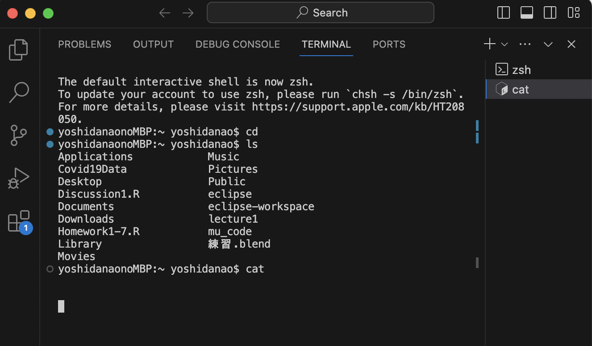
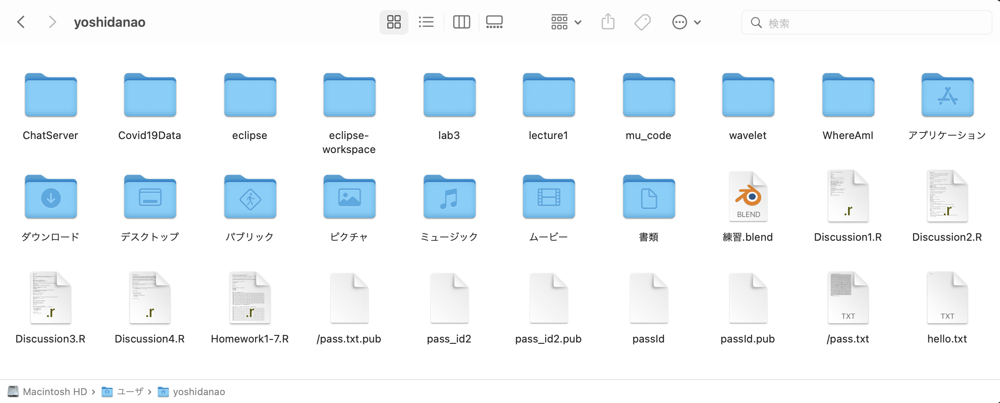
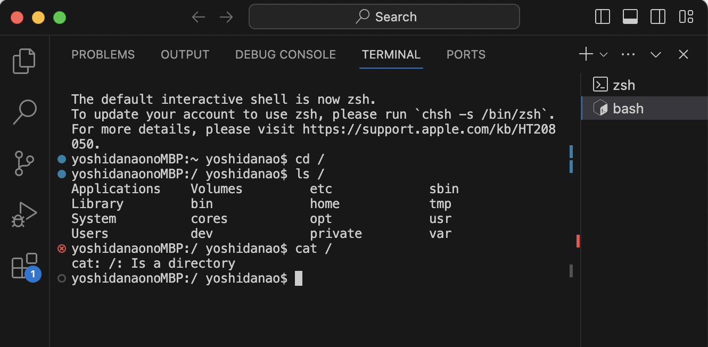

Lab Report 1
========= 
***

Name: Nao Yoshida |
PID:  A18083203 |
Spring 2024 UCSD - CSE 15L

***

Instruction
--------
For each of the commands cd, ls, and cat, and using the workspace you created in this lab:

    Share an example of using the command with no arguments.
    Share an example of using the command with a path to a directory as an argument.
    Share an example of using the command with a path to a file as an argument.

So that's 9 total examples (3 for each command). For each of the 9 examples, include:

    A screenshot or Markdown code block showing the command and its output.
    What the absolute path to the working directory was right before the command was run.
    A sentence or two explaining why you got that output (e.g. what was in the filesystem, what it meant to have no arguments).
    Indicate explicitly whether the output is an error or not, and if it's an error, explain why it's an error in one or two sentences. Note: Make sure to use backticks ` around keywords such as commands, file names, paths, etc. to make them show up as code like cd.

You will upload your submission by publishing the page on Github Pages, then printing the page to PDF and uploading to the Lab Report 1 assignment on Gradescope.

***

1. Example of using the command with no arguments.

- The absolute path to the working directory was right before the command was run : /Users/yoshidanao
- When I enter cd with no argument, it go back to the home environment, and  In my case, ~yoshidanao is the home environment. When I type cd, the status is already in home environment, so for our eyes, it does not do anything.
- When I enter ls, ls is list command, so it display what folders/documents the yoshidanao folder has.

- 
--------
   
2. Share an example of using the command with a path to a directory as an argument.

--------

3. Share an example of using the command with a path to a file as an argument.

--------

