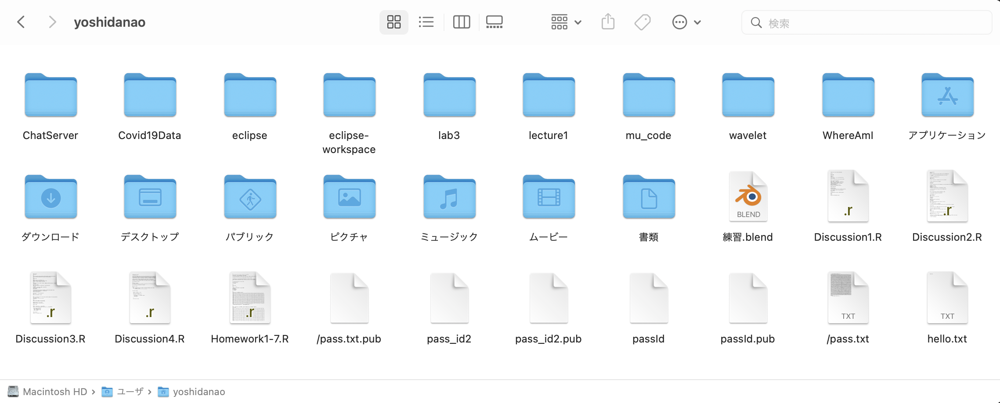
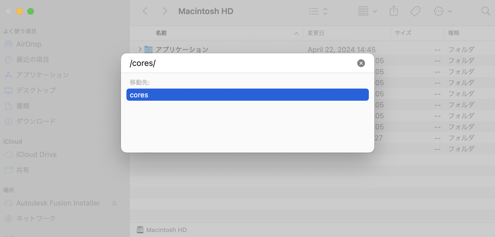
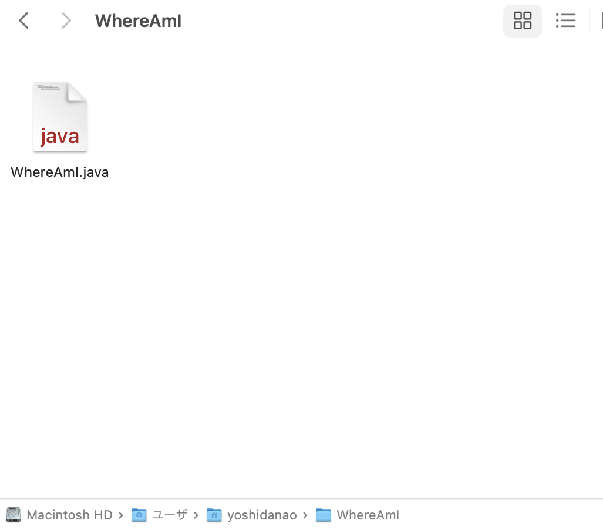
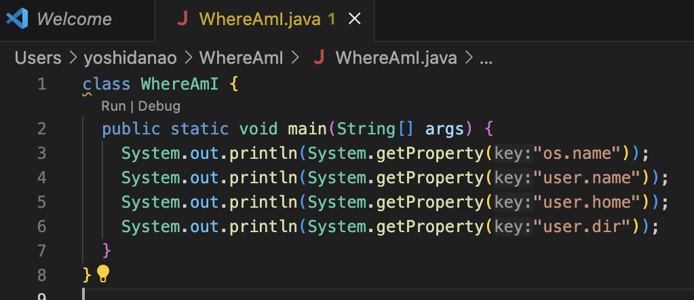

Lab Report 1
========= 
***

Name: Nao Yoshida |
PID:  A18083203 |
Spring 2024 UCSD - CSE 15L

***

Instruction
--------
For each of the commands `cd`, `ls`, and `cat`, and using the workspace you created in this lab:

    Share an example of using the command with no arguments.
    Share an example of using the command with a path to a directory as an argument.
    Share an example of using the command with a path to a file as an argument.

So that's 9 total examples (3 for each command). For each of the 9 examples, include:

    A screenshot or Markdown code block showing the command and its output.
    What the absolute path to the working directory was right before the command was run.
    A sentence or two explaining why you got that output (e.g. what was in the filesystem, what it meant to have no arguments).
    Indicate explicitly whether the output is an error or not, and if it's an error, explain why it's an error in one or two sentences. Note: Make sure to use backticks ` around keywords such as commands, file names, paths, etc. to make them show up as code like `cd`.

You will upload your submission by publishing the page on Github Pages, then printing the page to PDF and uploading to the Lab Report 1 assignment on Gradescope.

***

<b>1. Example of using the command with no arguments.</b>

        yoshidanaonoMacBook-Pro:~ yoshidanao$ cd
        yoshidanaonoMacBook-Pro:~ yoshidanao$ ls
        :pass.txt               Discussion3.R           Pictures                mu_code
        :pass.txt.pub           Discussion4.R           Public                  passId
        Applications            Documents               WhereAmI                passId.pub
        ChatServer              Downloads               eclipse                 pass_id2
        Covid19Data             Homework1-7.R           eclipse-workspace       pass_id2.pub
        Desktop                 Library                 hello.txt               wavelet
        Discussion1.R           Movies                  lab3                    練習.blend
        Discussion2.R           Music                   lecture1
        yoshidanaonoMacBook-Pro:~ yoshidanao$ cat

        

--> The absolute path to the working directory was right before the command was run : `/Users/yoshidanao`.

- When I enter `cd` with no argument, it go back to the home environment, and  In my case, `~yoshidanao` represent the home environment(default working directory). When I type cd, the status is already in home environment, so for our eyes, it does not do anything.

        yoshidanaonoMacBook-Pro:~ yoshidanao$ cd
  
- When I enter `ls`, `ls` is `list command`, so it display what folders/documents the `yoshidanao` folder has.

        yoshidanaonoMacBook-Pro:~ yoshidanao$ ls
        :pass.txt               Discussion3.R           Pictures                mu_code
        :pass.txt.pub           Discussion4.R           Public                  passId
        Applications            Documents               WhereAmI                passId.pub
        ChatServer              Downloads               eclipse                 pass_id2
        Covid19Data             Homework1-7.R           eclipse-workspace       pass_id2.pub
        Desktop                 Library                 hello.txt               wavelet
        Discussion1.R           Movies                  lab3                    練習.blend
        Discussion2.R           Music                   lecture1

Note: when I buy my laptop, I set Japanese language, so you will see Japanese, but these are the same folders and documents as what I got by ls command. Also, we can see the absolute path at the bottom of picture.
- When I enter `cat`, it does not do anything because I need to put documents which contains some texts to print out using `cat`.

        yoshidanaonoMacBook-Pro:~ yoshidanao$ cat
        
        

- Although `cat` does nothing, I do not see any error message in terminal. If I enter some text after that, `cat` will display the `<String>` I entered. According to professor's feedback, `cat` with no argument lead to infinite run, and it will read standard input and write out standard output. In order to leave the infinite run, we need to enter `control+c` (in Mac).

        yoshidanaonoMacBook-Pro:~ yoshidanao$ cat
        
        
        Hello world
        Hello world
        hello.txt
        hello.txt

--------
   
2. Share an example of using the command with a path to a directory as an argument.

        yoshidanaonoMacBook-Pro:~ yoshidanao$ cd /
        yoshidanaonoMacBook-Pro:/ yoshidanao$ ls
        Applications    Users           cores           home            sbin            var
        Library         Volumes         dev             opt             tmp
        System          bin             etc             private         usr
        yoshidanaonoMacBook-Pro:/ yoshidanao$ ls /
        Applications    Users           cores           home            sbin            var
        Library         Volumes         dev             opt             tmp
        System          bin             etc             private         usr
        yoshidanaonoMacBook-Pro:/ yoshidanao$ cd
        yoshidanaonoMacBook-Pro:~ yoshidanao$ ls /
        Applications    Users           cores           home            sbin            var
        Library         Volumes         dev             opt             tmp
        System          bin             etc             private         usr
        yoshidanaonoMacBook-Pro:~ yoshidanao$ cat /
        cat: /: Is a directory

--> The absolute path to the working directory was right before the command was run : `/`

- When I enter `cd /`, I see the change from `~yoshidanao` to `/yoshidanao`. It means the working directory was set to root folder `/`.

        yoshidanaonoMacBook-Pro:~ yoshidanao$ cd /
        yoshidanaonoMacBook-Pro:/ yoshidanao$
  
- When I enter `ls /`, it shows list under the root folder `/`. Also, entering `ls` after I set my working directry to root folder using `cd /` also display the same result.

        yoshidanaonoMacBook-Pro:/ yoshidanao$ ls
        Applications    Users           cores           home            sbin            var
        Library         Volumes         dev             opt             tmp
        System          bin             etc             private         usr
        yoshidanaonoMacBook-Pro:/ yoshidanao$ ls /
        Applications    Users           cores           home            sbin            var
        Library         Volumes         dev             opt             tmp
        System          bin             etc             private         usr
        yoshidanaonoMacBook-Pro:/ yoshidanao$ cd
        yoshidanaonoMacBook-Pro:~ yoshidanao$ ls /
        Applications    Users           cores           home            sbin            var
        Library         Volumes         dev             opt             tmp
        System          bin             etc             private         usr

Note: we can see above picture that `/` contains `Library`, `System`, `Users`, and `Application`. There are less folders than the list displayed by `ls` like that I see `Volumes` folder in the list of `/`, but not in my screenshot. However, I press `Command + Shift + G` in Finder on Mac to check if the list is correct by entering `/cores`.

Then I see the `cores`'s path at the bottom:

- When I enter `cat /`,  `/` (argument) is a directory and folder, so `cat` will tell the fact that `/ is a directory` and tells indirectly that the `cat` do nothing work with folder/directory and have no content to display because it is not file such that `.java` or `.txt`.

        yoshidanaonoMacBook-Pro:~ yoshidanao$ cat /
        cat: /: Is a directory

--------

3. Share an example of using the command with a path to a file as an argument.

The first 4 lines below are for setting up for doing task for this 3rd instruction:

        yoshidanaonoMacBook-Pro:wavelet yoshidanao$ cd
        yoshidanaonoMacBook-Pro:~ yoshidanao$ cd WhereAmI 
        yoshidanaonoMacBook-Pro:WhereAmI yoshidanao$ ls
        WhereAmI.java
        yoshidanaonoMacBook-Pro:WhereAmI yoshidanao$ cd WhereAmI.java
        bash: cd: WhereAmI.java: Not a directory
        yoshidanaonoMacBook-Pro:WhereAmI yoshidanao$ ls WhereAmI.java
        WhereAmI.java
        yoshidanaonoMacBook-Pro:WhereAmI yoshidanao$ cat WhereAmI.java
        class WhereAmI {
          public static void main(String[] args) {
            System.out.println(System.getProperty("os.name"));
            System.out.println(System.getProperty("user.name"));
                  System.out.println(System.getProperty("user.home"));
                  System.out.println(System.getProperty("user.dir"));
                }
        }

--> The absolute path to the working directory was right before the command `cd` with file was run : `/Users/yoshidanao/WhereAmI`

- When I enter `cd WhereAmI.java`, it displays the error message becuase `cd` command will only accept directory and the `WhereAmI.java` is not the such directory but java file.

        yoshidanaonoMacBook-Pro:WhereAmI yoshidanao$ cd WhereAmI.java
        bash: cd: WhereAmI.java: Not a directory

- When I enter 'ls WhereAmI.java', I see the list of things contained in GitHub folder. Note that GitHub folder is inside the 'Documents' folder.

        yoshidanaonoMacBook-Pro:WhereAmI yoshidanao$ ls WhereAmI.java
        WhereAmI.java
  
- If I do not change the working directory from `~ yoshidanao` to `WhereAmI yoshidanao` and I use 'ls WhereAmI.java', error message will be displayed:

        yoshidanaonoMacBook-Pro:~ yoshidanao$ ls WhereAmI.java
        ls: WhereAmI.java: No such file or directory

I the first example I did with working directory `WhereAmI` work because it knows `WhereAmI` has `WhereAmI.java` and it is the very last document(`WhereAmI.java` is not a folder), so it displays `WhereAmI.java` and there is no more directory go over. For second example starting with working directory `~ yoshidanao`, it has no clue to know where it is. In other words, it cannot track the file without detailed path. If I do it with the detailed path(can be absolute), I get the same result as the first example, but displaying with tha path I entered:

        yoshidanaonoMacBook-Pro:~ yoshidanao$ ls WhereAmI/WhereAmI.java
        WhereAmI/WhereAmI.java

From this, we can know that ls can access the documents which are inside the currnt working directory. 

- When I enter `cat WhereAmI.java` that is inside the Documents, it displayed the entire code of this java file.

        yoshidanaonoMacBook-Pro:WhereAmI yoshidanao$ cat WhereAmI.java
        class WhereAmI {
          public static void main(String[] args) {
            System.out.println(System.getProperty("os.name"));
            System.out.println(System.getProperty("user.name"));
                  System.out.println(System.getProperty("user.home"));
                  System.out.println(System.getProperty("user.dir"));
                }
        }

As the same reason as `ls`, if working directory is `~`, `cat` cannot access to `WhereAmI.java` without specific or absolute path:

        yoshidanaonoMacBook-Pro:~ yoshidanao$ cat WhereAmI.java
        cat: WhereAmI.java: No such file or directory

Fixed version with `WhereAmI/WhereAmI.java` instead of `WhereAmI.java`:

        yoshidanaonoMacBook-Pro:~ yoshidanao$ cat WhereAmI/WhereAmI.java
        class WhereAmI {
          public static void main(String[] args) {
            System.out.println(System.getProperty("os.name"));
            System.out.println(System.getProperty("user.name"));
                  System.out.println(System.getProperty("user.home"));
                  System.out.println(System.getProperty("user.dir"));
                }
        }

Following is the screenshot of the inside of `WhereAmI` folder and we can see `WhereAmI.java`:

Following is the screenshot of the content of `WhereAmI.java` which matches the output of `cat WhereAmI.java`:

--------

Completed: April 24th, 2024 | Resubmit Lab due: April 24th, 2024 | GitHub link: https://naoy220.github.io/cse15l-lab-reports/labReport1.html

