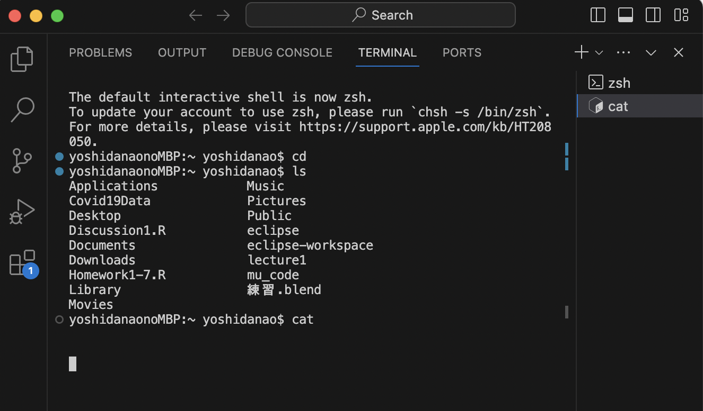
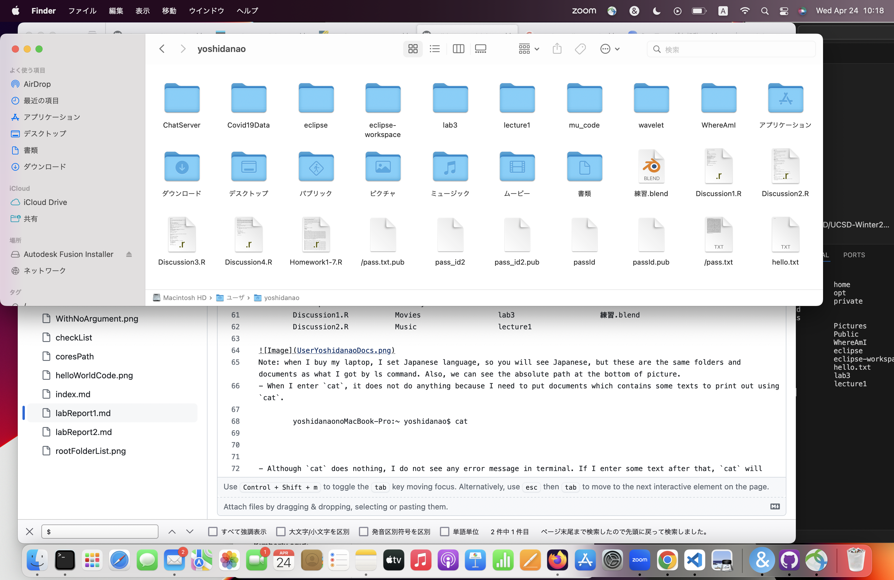
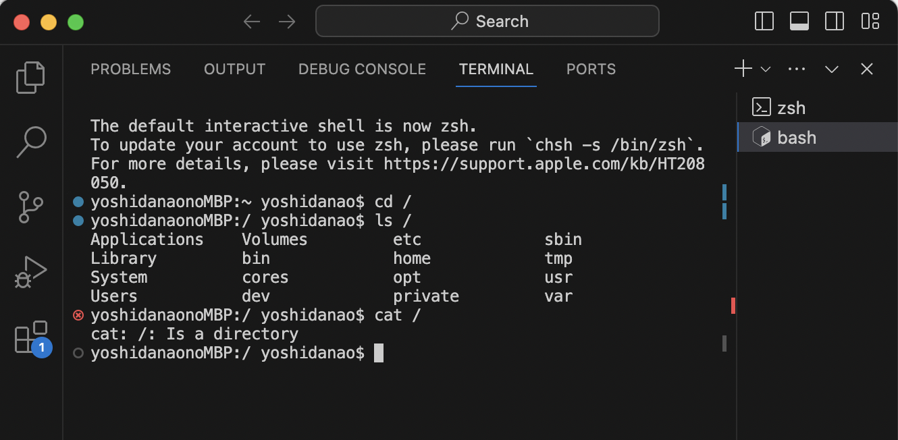
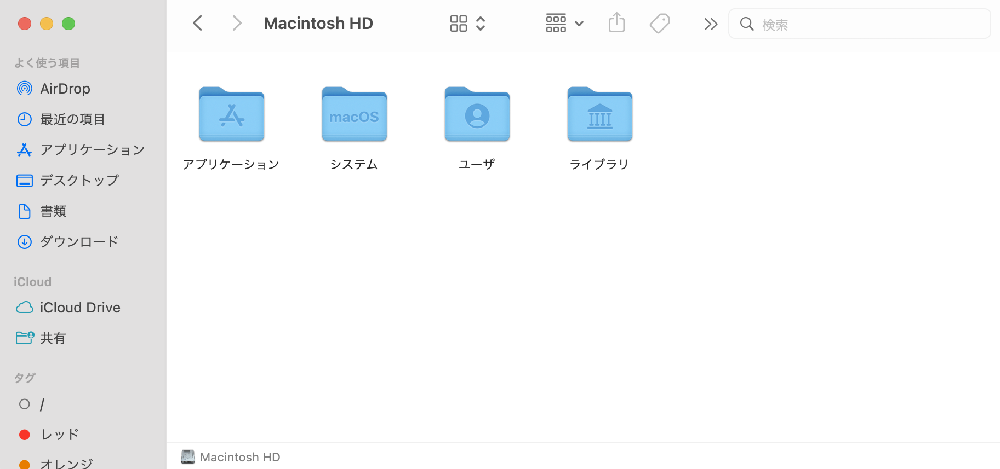
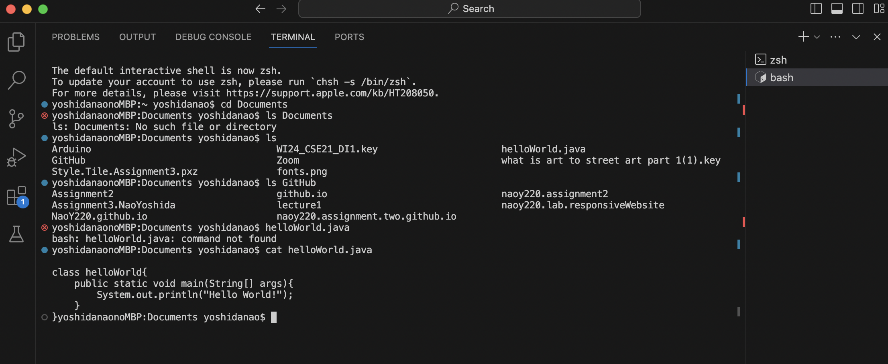
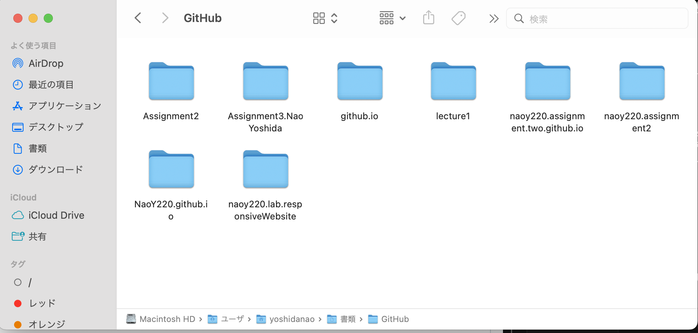
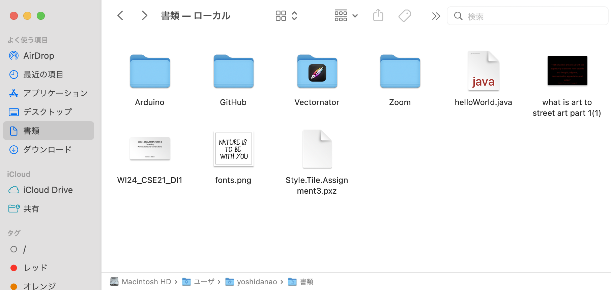
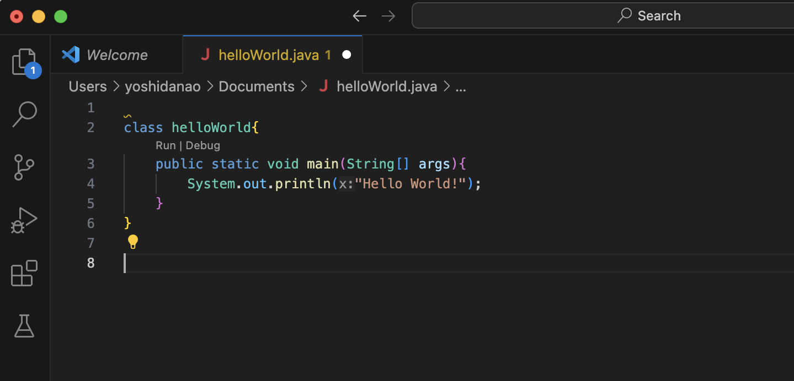

Lab Report 1
========= 
***

Name: Nao Yoshida |
PID:  A18083203 |
Spring 2024 UCSD - CSE 15L

***

Instruction
--------
For each of the commands cd, ls, and cat, and using the workspace you created in this lab:

    Share an example of using the command with no arguments.
    Share an example of using the command with a path to a directory as an argument.
    Share an example of using the command with a path to a file as an argument.

So that's 9 total examples (3 for each command). For each of the 9 examples, include:

    A screenshot or Markdown code block showing the command and its output.
    What the absolute path to the working directory was right before the command was run.
    A sentence or two explaining why you got that output (e.g. what was in the filesystem, what it meant to have no arguments).
    Indicate explicitly whether the output is an error or not, and if it's an error, explain why it's an error in one or two sentences. Note: Make sure to use backticks ` around keywords such as commands, file names, paths, etc. to make them show up as code like cd.

You will upload your submission by publishing the page on Github Pages, then printing the page to PDF and uploading to the Lab Report 1 assignment on Gradescope.

***

1. Example of using the command with no arguments.

- The absolute path to the working directory was right before the command was run : '/Users/yoshidanao'
- When I enter 'cd' with no argument, it go back to the home environment, and  In my case, '~yoshidanao' represent the home environment(default working directory). When I type cd, the status is already in home environment, so for our eyes, it does not do anything.
- When I enter 'ls', ls is list command, so it display what folders/documents the yoshidanao folder has.

Note: when I buy my laptop, I set Japanese language, so you will see Japanese, but these are the same folders and documents as what I got by ls command. Also, we can see the absolute path at the bottom of picture.
- When I enter 'cat', it does not do anything because I need to put documents which contains some texts to print out using cat. 

--------
   
2. Share an example of using the command with a path to a directory as an argument.

- The absolute path to the working directory was right before the command was run : '/'
- When I enter 'cd /', I see the change from '~yoshidanao' to '/yoshidanao'. It means the working directory was set to root folder '/'.
- When I enter 'ls /', it shows list under the root folder '/'.

Note: we can see above picture that '/' contains 'Library', 'System', 'Users', and 'Application'. I am not sure why there are less folders than the list displayed by 'ls'. I see Volumes folder contains root folder '/', so I think the folders I cannot see in the above picture contain root folder inside itself, and it prevent us seeing it. 
- When I enter 'cat /', it displays error because '/' (argument) is a directory and it cannot process to print out. 
--------

3. Share an example of using the command with a path to a file as an argument.

- The absolute path to the working directory was right before the command was run : '/Users/yoshidanao/Documents'
- When I enter 'cd Documents', I see the change from '~yoshidanao' to 'Documents yoshidanao'. It means that 'Documents' was set as working directory, and the absolute path I mentioned above is set by 'cd'.
- When I enter 'ls GitHub', I see the list of things contained in GitHub folder. Note that GitHub folder is inside the 'Documents' folder.

- When I enter 'cat helloWorld.java' that is inside the Documents, it displayed the entire code of this java file.

--------

Completed: April 8th, 2024 | Lab due: April 9th, 2024 | GitHub link: https://naoy220.github.io/cse15l-lab-reports/labReport1.html

