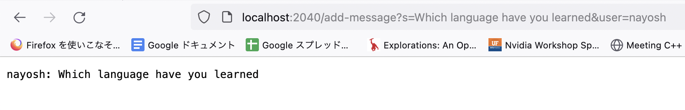
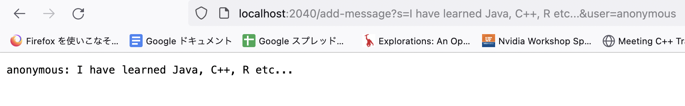

Lab Report 2
========= 
***

Name: Nao Yoshida |
PID:  A18083203 |
Spring 2024 UCSD - CSE 15L

***

Part 1 
--------
Write a web server called `ChatServer` that supports the path and behavior described below. It should keep track of a single string that gets added to by incoming requests. The requests should look like this:

`/add-message?s=<string>&user=<string>`

The effect of this request is to concatenate the string given after `user=`, a colon (`:`), and then the string after `s`, a newline (`\n`), and then respond with the entire string so far. That is, it adds a chat message of the form `<user>: <message>`

So, for example, after

      /add-message?s=Hello&user=jpolitz

The page should show

      jpolitz: Hello

and after

      /add-message?s=How are you&user=yash

the page should show

      jpolitz: Hello 
      yash: How are you

(Some browsers might show this as How%20are%20you with a special character replacing the spaces; don't worry about fixing that for this example. If you want to look it up it has to do with URL encoding, a topic we won't address right now.) You can assume that the `s=` parameter always comes before the `user=` parameter, and they are always separated by a `&` as shown above.

1. Show the code for your `ChatServer`, and two screenshots of using `/add-message`.

For each of the two screenshots, answer the followings three questions:
2. Which methods in your code are called?
3. What are the relevant arguments to those methods, and the values of any relevant fields of the class?
4. How do the values of any relevant fields of the class change from this specific request? If no values got changed, explain why.

By values, we mean specific Strings, ints, URIs, and so on. "abc" is a value, 456 is a value, new URI("http://...") is a value, and so on.)

--------

<b>1. Show the code for your `ChatServer`, and two screenshots of using `/add-message`.</b>

My code for `ChatServer`: 

            import java.io.IOException;
            import java.net.URI;
            //import java.io.FileWriter;
            //import java.util.List;
            //import java.io.File;
            //import java.io.FileReader;
            //import java.nio.file.Files;
            //import java.nio.file.Paths;
            
            //Lab report 2 Chat Server
            //If I enter like ".../add-message?s=<string>&user=<string>", the message will be displayed like : "string(user): string(s)"
            
            class Handler implements URLHandler {
              public String handleRequest(URI url){
                    String username = "", message = "";
                    //List<String> outputs;
            
                    if (url.getPath().equals("/")) {
                    return "it is home page! to add message, use the format: /add-message?s=<string>&user=<string>";
                    }
                    else{
                        if (url.getPath().equals("/add-message")) {
                            //FileWriter addSentence = new FileWriter("Thread.txt");
            
                            String[] parameters = url.getQuery().split("&");
                            if (parameters[0].substring(0,2).equals("s=")) {
                                message = parameters[0].substring(2, parameters[0].length());
                            }
                            if (parameters.length==2 && parameters[1].substring(0,5).equals("user=")) {
                                username = parameters[1].substring(5, parameters[1].length());
                            }
                            /*
                            outputs = Files.readAllLines(Paths.get("Thread.txt"));
                            addSentence.write(String.format("%s: %s\n", username, message));
                            addSentence.close();
                            */
                            //return String.join("\n", outputs) + "\n" + String.format("%s: %s\n", username, message);
            
                            return String.format("%s: %s\n", username, message);
                        }
                        return "invalid path!";
                    }
                }
            }
            
            class ChatServer {
              public static void main(String[] args) throws IOException {
            
                  /* 
                  File threadFile = new File("Thread.txt");
                  if(!threadFile.exists()){
                      threadFile.createNewFile();
                  }*/
            
                  if(args.length == 0){
                      System.out.println("Missing port number! Try any number between 1024 to 49151");
                      return;
                  }
                  int port = Integer.parseInt(args[0]);
                  Server.start(port, new Handler());
                }
            }

Note: I was struggled with how I can leave the previous data like `jpolitz: Hello` is also displayed after `/add-message?s=How are you&user=yash`. My idea in order to work as that way is using `txt file` to store the previous data added. 

<ins>First input</ins>: `http://localhost:2040/add-message?s=Which language have you learned&user=nayosh`

<ins>Second input</ins>: `http://localhost:2040/add-message?s=I have learned Java, C++, R etc...&user=anonymous`

The ideal output for Second one is 

            nayosh: Which language have you learned
            anonymous: I have learned Java, C++, R etc...

However, as I mentioned, I could not figure out the way to display the previous output together. 

<b>2. Which methods in your code are called?</b>

--> `handleRequest(URI url)` to see if the `query` and `parameter` is correctly implemented by user, and if the input(url with query and parameter) is correctly written out, then the web page show the parameter in the format: `<user>: <message>`. From my example, `http://localhost:2040/add-message?s=Which language have you learned&user=nayosh` has query is `?` and parameter(as one object) is `s=Which language have you learned&user=nayosh`. There are two parameters inside the big parameter: `s=<string>` and `user=<string>`. Also, `Server.start(port, new Handler())` is also the method call in `ChatServer` class. It is for opening new server with the port number which user decided, and this task is done in `Server.java`.

<b>3. What are the relevant arguments to those methods, and the values of any relevant fields of the class?</b>

--> I will see one by one. For `class Handler`, it has method `handleRequest(URI url)`. This method receive the parameter `url` which is the object of `URI` is `URL identifer` and it is usable through URI library: `import java.net.URI;` which allow us to use several functions such that `getPath()` for getting the `path of URL` and `getQuery()` for finding the line after the `query ?` position. The value of `message` and `username` is `variable` to display in webpage, and each receive the data `<string>` from the URL parameter `s=<string>&user=<string>`.

            class Handler implements URLHandler {
              public String handleRequest(URI url){
                    String username = "", message = "";
                    //List<String> outputs;
            
                    if (url.getPath().equals("/")) {
                    return "it is home page! to add message, use the format: /add-message?s=<string>&user=<string>";
                    }
                    else{
                        if (url.getPath().equals("/add-message")) {
                            //FileWriter addSentence = new FileWriter("Thread.txt");
            
                            String[] parameters = url.getQuery().split("&");
                            if (parameters[0].substring(0,2).equals("s=")) {
                                message = parameters[0].substring(2, parameters[0].length());
                            }
                            if (parameters.length==2 && parameters[1].substring(0,5).equals("user=")) {
                                username = parameters[1].substring(5, parameters[1].length());
                            }
                            /*
                            outputs = Files.readAllLines(Paths.get("Thread.txt"));
                            addSentence.write(String.format("%s: %s\n", username, message));
                            addSentence.close();
                            */
                            //return String.join("\n", outputs) + "\n" + String.format("%s: %s\n", username, message);
            
                            return String.format("%s: %s\n", username, message);
                        }
                        return "invalid path!";
                    }
                }
            }

--> For the class 'ChatServer', there is `public static void main(String[] args) throws IOException` for getting the command-line in terminal. `String[] arg` receive the input in the terminal after the string `java ChatServer`. For example, I entered `java ChatServer 2040` in terminal, then `2040` will be passed into `args[0]`. There is `IOException check` if there is argument in terminal or not. If there is no command-line argument, it will display `error message`. Otherwise, the one argument which is number will be passed to the `port`. Then, the port and the new object `Handler` in `ChatServer.java` will be passed as parameter of `start()` method in `Server.java`.
            
            class ChatServer {
              public static void main(String[] args) throws IOException {
            
                  /* 
                  File threadFile = new File("Thread.txt");
                  if(!threadFile.exists()){
                      threadFile.createNewFile();
                  }*/
            
                  if(args.length == 0){
                      System.out.println("Missing port number! Try any number between 1024 to 49151");
                      return;
                  }
                  int port = Integer.parseInt(args[0]);
                  Server.start(port, new Handler());
                }
            }

<b>4. How do the values of any relevant fields of the class change from this specific request? If no values got changed, explain why.</b>

--> The value will be changed from the specific request because user can modify `<string>` term in the URL parameter `s=<string>&user=<string>` if the he/she implement URL correcly like the order of path, query and parameter, and consider it is case sensitive. From my exmaple, variable `username` is changed from `nayosh` to `anonymous`, and `message` is changed to `Which language have you learned' to 'I have learned Java, C++, R etc...`. For `Server.start(port, new Handler())`, the value of `port` is also variable taken from user input in `terminal(command-line)`. If we put the value which is not number and non integer number, it will lead some error because there is code:  `Integer.parseInt()` that change "string integer number" to integer. Also, it has the range : `1024 to 49151`. If user satisfy that rule, he/she can change the port number as they like. 

   
Part 2
--------

Include a screenshot for each of the following:

1. On the command line of your computer, run `ls` with the absolute path to the private key for your SSH key for logging into `ieng6`.
2. On the command line of the `ieng6` machine, run `ls` with the absolute path to the public key for your SSH key for logging into `ieng6` (this is the one you copied to your account on `ieng6` using `ssh-copy-id`, so it should be a path on ieng6's file system).
3. A terminal interaction where you log into your `ieng6` account without being asked for a password.

--------

<b>1. On the command line of your computer, run `ls` with the absolute path to the private key for your SSH key for logging into `ieng6`.</b>

--> My absolute path to the private key is : `/Users/yoshidanao/passId`

Terminal:

            yoshidanaonoMacBook-Pro:~ yoshidanao$ ls /Users/yoshidanao/passId
            /Users/yoshidanao/passId

<b>2. On the command line of the `ieng6` machine, run `ls` with the absolute path to the public key for your SSH key for logging into `ieng6` (this is the one you copied to your account on ieng6 using `ssh-copy-id`, so it should be a path on ieng6's file system).</b>

--> I could not access to the file and also I used `ls` to see what is happening and there are only three documents: `hello.txt  perl5  wavelet`. 

Terminal:

            [nayoshida@ieng6-201]:~:36$ ls /Users/yoshidanao/.ssh/passId.pub
            ls: cannot access /Users/yoshidanao/.ssh/passId.pub: No such file or directory

My try:

            yoshidanaonoMacBook-Pro:~ yoshidanao$ ssh-keygen
            Generating public/private rsa key pair.
            Enter file in which to save the key (/Users/yoshidanao/.ssh/id_rsa): /Users/yoshidanao/pass_id2
            Enter passphrase (empty for no passphrase): 
            Enter same passphrase again: 
            Your identification has been saved in /Users/yoshidanao/pass_id2
            Your public key has been saved in /Users/yoshidanao/pass_id2.pub
            The key fingerprint is:
            SHA256:lMuaKR4ZbJzFag44qcqLjC4pTYs4Ar05G53aJiGO0bE yoshidanao@yoshidanaonoMacBook-Pro.local
            The key's randomart image is:
            +---[RSA 3072]----+
            |                 |
            |     .   .       |
            |      o o        |
            | o.o + o .       |
            |+o.oO   S        |
            |=.E* + +         |
            |*B.=B +          |
            |/.B=.o           |
            |O*+=o            |
            +----[SHA256]-----+
            yoshidanaonoMacBook-Pro:~ yoshidanao$ ssh-copy-id -i /Users/yoshidanao/pass_id2 nayoshida@ieng6.ucsd.edu
            /usr/bin/ssh-copy-id: INFO: Source of key(s) to be installed: "/Users/yoshidanao/pass_id2.pub"
            /usr/bin/ssh-copy-id: INFO: attempting to log in with the new key(s), to filter out any that are already installed
            /usr/bin/ssh-copy-id: INFO: 1 key(s) remain to be installed -- if you are prompted now it is to install the new keys
            Enter passphrase for key '/Users/yoshidanao/.ssh/id_rsa': 
            
            Number of key(s) added:        1
            
            Now try logging into the machine, with:   "ssh 'nayoshida@ieng6.ucsd.edu'"
            and check to make sure that only the key(s) you wanted were added.

After I log into account:

            [nayoshida@ieng6-201]:~:55$ ls
            hello.txt  perl5  wavelet
            [nayoshida@ieng6-201]:~:56$ ls /Users/yoshidanao/pass_id2.pub
            ls: cannot access /Users/yoshidanao/pass_id2.pub: No such file or directory

--> I tried with `/Users/yoshidanao/.ssh/id_rsa`, but it shows me the same result as above. I think I did wrong and it is not the purpose of this instruction. 

<b>3. A terminal interaction where you log into your `ieng6` account without being asked for a password.</b>

            yoshidanaonoMacBook-Pro:~ yoshidanao$ ssh nayoshida@ieng6.ucsd.edu
            Enter passphrase for key '/Users/yoshidanao/.ssh/id_rsa': 
            Last login: Wed Apr 24 02:21:19 2024 from 100.64.134.187
            Hello nayoshida, you are currently logged into ieng6-201.ucsd.edu
            
            You are using 0% CPU on this system
            
            Cluster Status 
            Hostname     Time    #Users  Load  Averages  
            ieng6-201   02:25:01   4  0.01,  0.23,  0.36
            ieng6-202   02:25:01   1  0.00,  0.03,  0.09
            ieng6-203   02:25:01   4  1.00,  1.09,  1.20
            
             
            
            To begin work for one of your courses [ cs15lsp24 ], type its name 
            at the command prompt.  (For example, "cs15lsp24", without the quotes).
            
            To see all available software packages, type "prep -l" at the command prompt,
            or "prep -h" for more options.

Note: before this lab, we had to enter the `UCSD account password` in order to log into `nayoshida@ieng6.ucsd.edu`. Now, I can log into this account with easier password or just click `enter`. The following is the line for asking user to enter passphrase for key.

            Enter passphrase for key '/Users/yoshidanao/.ssh/id_rsa':

Part 3
--------

In 2-3 sentences, describe something you learned from lab in week 2 or 3 that you didn't know before.

--------

For me, it was my first time using the `bash` terminal and using several commands other than command-line arguments, so everything was new to me! Also, it is the first time to create a `markdown file` in Github, so my first lab report was not fine work, but I started to figure out how we can do it. ssh and remote logging to the account sometimes confuse me, but I think I can get used to using it during this quarter.  

--------

Completed: 23th, 2024

Lab due: 24th, 2024

GitHub link: [https://github.com/NaoY220/cse15l-lab-reports.git](https://naoy220.github.io/cse15l-lab-reports/labReport2.html)
