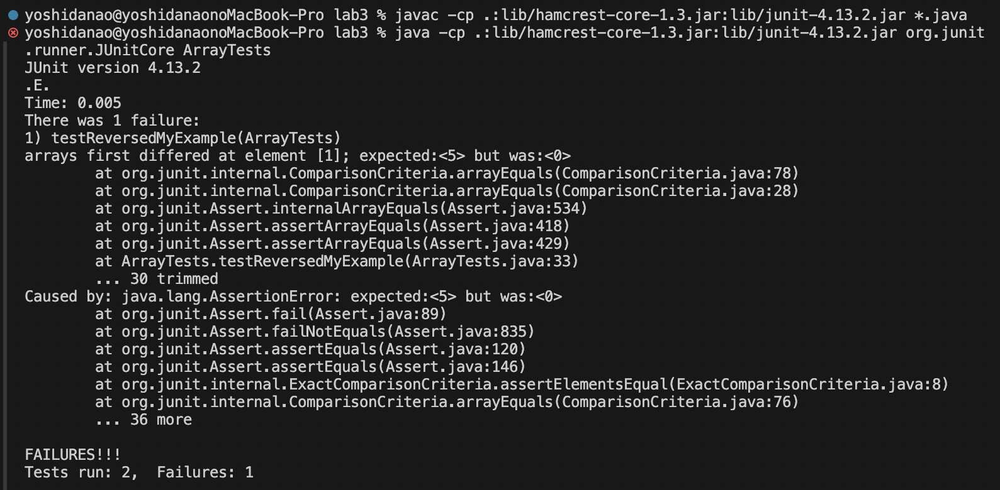

Lab Report 3
========= 
***

Name: Nao Yoshida |
PID:  A18083203 |
Spring 2024 UCSD - CSE 15L

***

Part 1 - Bugs
--------

Choose one of the bugs from week 4's lab.

Provide:

1. A failure-inducing input for the buggy program, as a **JUnit test** and any associated code (write it as a code block in Markdown).
2. An input that doesn't induce a failure, as a **JUnit test** and any associated code (write it as a code block in Markdown).
3. The symptom, as the output of running the two tests above (provide it as a **screenshot** -- one test should pass, one test should fail).
4. The bug, as the before-and-after code change required to fix it (as two **code blocks** in Markdown).
5. Briefly describe (2-3 sentences) why the fix addresses the issue.

***

The bugs which I choosed from week 4's lab : `reversed()` function from `ArrayExamples.java`

        // Returns a *new* array with all the elements of the input array in reversed order
        static int[] reversed(int[] arr) {
              int[] newArray = new int[arr.length];
              for(int i = 0; i < arr.length; i += 1) {
                    arr[i] = newArray[arr.length - i - 1];
              }
              return arr;
        }

<b>1.  A failure-inducing input for the buggy program, as a **JUnit test** and any associated code (write it as a code block in Markdown).</b>

JUnit test code:

        // reversed()
        @Test
        public void testReversedMyExample() {
            int[] input1 = {-1, 3, 5, 0};
        assertArrayEquals(new int[]{0, 5, 3, -1}, ArrayExamples.reversed(input1));
        }

Note that this returns `failure` due not to match expected and actual outputs:

        yoshidanao@yoshidanaonoMacBook-Pro lab3 % javac -cp .:lib/hamcrest-core-1.3.jar:lib/junit-4.13.2.jar *.java
        yoshidanao@yoshidanaonoMacBook-Pro lab3 % java -cp .:lib/hamcrest-core-1.3.jar:lib/junit-4.13.2.jar org.junit.runner.JUnitCore ArrayTests
        JUnit version 4.13.2
        .E
        Time: 0.004
        There was 1 failure:
            1) testReversedMyExample(ArrayTests)
            arrays first differed at element [1]; expected:<5> but was:<0>
                    at org.junit.internal.ComparisonCriteria.arrayEquals(ComparisonCriteria.java:78)
                    at org.junit.internal.ComparisonCriteria.arrayEquals(ComparisonCriteria.java:28)
                    at org.junit.Assert.internalArrayEquals(Assert.java:534)
                    at org.junit.Assert.assertArrayEquals(Assert.java:418)
                    at org.junit.Assert.assertArrayEquals(Assert.java:429)
                    at ArrayTests.testReversedMyExample(ArrayTests.java:32)
                    ... 30 trimmed
            Caused by: java.lang.AssertionError: expected:<5> but was:<0
                    at org.junit.Assert.fail(Assert.java:89)
                    at org.junit.Assert.failNotEquals(Assert.java:835)
                    at org.junit.Assert.assertEquals(Assert.java:120)
                    at org.junit.Assert.assertEquals(Assert.java:146)
                    at org.junit.internal.ExactComparisonCriteria.assertElementsEqual(ExactComparisonCriteria.java:8)
                    at org.junit.internal.ComparisonCriteria.arrayEquals(ComparisonCriteria.java:76)
                    ... 36 more
                  
        FAILURES!!!
        Tests run: 1,  Failures: 1

We see that the error is found in `element [1]` of array that contains actual value `0`, not expected `5`. It happens because there is an error in the `reversed()` function in `ArrayExamples.java` and `ArrayExamples.reversed(input1)` results in `{0,0,0,0}` instead of `{0, 5, 3, -1}`. The reason why we do not see no more explanation of error we face other than `expected:<5> but was:<0>` is because it leave current `test` function immediately when the program find out there is error(exception). 

--------
   
<b>2. An input that doesn't induce a failure, as a **JUnit test** and any associated code (write it as a code block in Markdown).</b>

JUnit test code:

        @Test
        public void testReversedMyExample2() {
           int[] input1 = {0,0,0};
        assertArrayEquals(new int[]{0,0,0}, ArrayExamples.reversed(input1));
        }

The result of processing this test:

        yoshidanao@yoshidanaonoMacBook-Pro lab3 % javac -cp .:lib/hamcrest-core-1.3.jar:lib/junit-4.13.2.jar *.java
        yoshidanao@yoshidanaonoMacBook-Pro lab3 % java -cp .:lib/hamcrest-core-1.3.jar:lib/junit-4.13.2.jar org.junit.runner.JUnitCore ArrayTests
        JUnit version 4.13.2
        .
        Time: 0.003
        
        OK (1 test)

Note that there is no error because the expected and actual values matched.

--------
   
<b>3. The symptom, as the output of running the two tests above (provide it as a **screenshot** -- one test should pass, one test should fail).</b>

Note that we will know it processed two tests out and found 1 failure : `Tests run: 2,  Failures: 1`

--------
   
<b>4. The bug, as the before-and-after code change required to fix it (as two **code blocks** in Markdown).</b>

Code before fixed:

        static int[] reversed(int[] arr) {
           int[] newArray = new int[arr.length];
           for(int i = 0; i < arr.length; i += 1) {
           arr[i] = newArray[arr.length - i - 1];
           }
           return arr;
        }

Code after fixed:

        static int[] reversed(int[] arr) {
            int[] newArray = new int[arr.length];
            for(int i = 0; i < arr.length; i += 1) {
               newArray[i] = arr[arr.length - i - 1];
            }
            return newArray;
        }

Note that I modified two points:

1) from `arr[i] = newArray[arr.length - i - 1];` to `newArray[i] = arr[arr.length - i - 1];`
2) from `return arr;` to `return newArray;`

Previous code tried to set value of `newArray` array which is `null` to the `arr`array, so it resulted in returning `null array`. To return new array with the numbers sorted in reversed order, we need to update the content of `newArray` array using `arr` elements.

--------
   
<b>5. Briefly describe (2-3 sentences) why the fix addresses the issue.</b>

The previous code tried to set value of `newArray` array which is `null(0)` to the `arr`array, so it resulted in returning `null(all 0) array` although the inputs are varied. However, the purpose of `reversed()` function is to return the new array with the numbers sorted in reversed order, so we need to update the content of `newArray` array using elements of `arr` array, and then, it work as intended. 

Part 2 - Researching Commands
--------

Consider the commands `less`, `find`, and `grep`. Choose one of them. Online, find 4 interesting command-line options or alternate ways to use **the single command you chose**. Many commands like these have pretty sophisticated behavior possible – it can take years to be exposed to and learn all of the possible tricks and inner workings. To find information about the commands, a simple Web search like “find command-line options” will probably give decent results. There is also a built-in command on many systems called `man` (short for “manual”) that displays information about commands; you can use `man grep`, for example, to see a long listing of information about how `grep` works. Also, consider asking ChatGPT!

For example, we saw the `-name` option for `find` in class.

Instruction: For each of those options, give 2 examples of using it on files and directories from `./technical`. That makes 8 total examples, all focused on a single command. Show **each example** as a code block that shows the command and its output, and write a sentence or two about what it’s doing and why it’s useful.

Along with each option/mode you show, **cite your source** for how you found out about it as a URL or a description of where you found it. See the syllabus on Academic Integrity and how to cite sources like ChatGPT for this class.

***

`grep` : we can use this command for search and collect data in many ways.

I used ChatGPT to see what kind of command that I can use with `grep`, and I got as the following:

First setup for doing this task:

        yoshidanao@yoshidanaonoMacBook-Pro ~ % cd docsearch
        yoshidanao@yoshidanaonoMacBook-Pro docsearch % ls
        DocSearchServer.java    biomednplos-sizes.txt   labrep3.txt             plos-sizes.txt          technical
        README.md               count-txts.sh           lib                     size.txt
        Server.java             find-results.txt        mostWord.txt            sizeOfstringSearch.txt
        TestDocSearch.java      findMost.sh             newCount-txt.sh         sort.txt
        biomed-sizes.txt        grep-results.txt        plos-size.txt           string.txt
        yoshidanao@yoshidanaonoMacBook-Pro docsearch % find ./technical > labrep3.txt

Note that I saved all contents of both txt files and directories inside `./technical` into `labrep3.txt`.

<b>1. `-e` : It will help us to specify several pattern to search the document if it contains at least one of patterns specified. </b>

First example with files:

        yoshidanao@yoshidanaonoMacBook-Pro docsearch % grep -e "ti" -e "hi" labrep3.txt                          
        ./technical/government/About_LSC/diversity_priorities.txt
        ./technical/government/About_LSC/reporting_system.txt
        ./technical/government/About_LSC/conference_highlights.txt
        ./technical/government/Env_Prot_Agen/multi102902.txt
        ./technical/government/Env_Prot_Agen/section-by-section_summary.txt
        ./technical/government/Env_Prot_Agen/tech_sectiong.txt
        ./technical/government/Gen_Account_Office/Testimony_cg00010t.txt
        ./technical/government/Gen_Account_Office/GovernmentAuditingStandards_yb2002ed.txt
        ./technical/government/Gen_Account_Office/Testimony_Jul15-2002_d02940t.txt
        ./technical/government/Gen_Account_Office/Testimony_d01609t.txt
        ./technical/government/Gen_Account_Office/Testimony_Jul17-2002_d02957t.txt
        ./technical/government/Post_Rate_Comm/Cohenetal_Cost_Function.txt
        ./technical/government/Media/balance_scales_of_justice.txt
        ./technical/government/Media/Legal-aid_chief.txt
        ./technical/government/Media/Targeting_Domestic_Violence.txt
        ./technical/government/Media/highlight_Senior_Day.txt
        ./technical/government/Media/Supporting_Legal_Center.txt
        ./technical/government/Media/Domestic_Violence_Ruling.txt
        ./technical/government/Media/Abuse_penalties.txt
        ./technical/government/Media/Justice_for_all.txt
        ./technical/government/Media/Philly_Lawyers.txt
        ./technical/government/Media/Eviction_law.txt
        ./technical/government/Media/Higher_Registration_Fees.txt
        ./technical/government/Media/Fire_Victims_Sue.txt
        ./technical/government/Media/Justice_requests.txt
        ./technical/government/Media/Low-income_children.txt
        ./technical/government/Media/man_on_national_team.txt
        ./technical/government/Media/Attorney_gives_his_time.txt
        ./technical/government/Media/All_May_Have_Justice.txt
        ./technical/government/Media/Domestic_violence_aid.txt
        ./technical/government/Media/fight_domestic_abuse.txt
        ./technical/government/Media/CommercialAppealMemphis2.txt
        ./technical/government/Media/The_Bend_Bulletin.txt
        ./technical/government/Media/Entities_Merge.txt
        ./technical/government/Media/Politician_Practices.txt
        ./technical/government/Media/Retirement_Has_Its_Appeal.txt

To see if the file really contain either `"ti"`, `"hi"`, or both, I use `grep "hi" labrep3.txt` and `grep "ti" labrep3.txt`:

        yoshidanao@yoshidanaonoMacBook-Pro docsearch % grep "hi" labrep3.txt 
        ./technical/government/About_LSC/conference_highlights.txt
        ./technical/government/Media/Legal-aid_chief.txt
        ./technical/government/Media/highlight_Senior_Day.txt
        ./technical/government/Media/Philly_Lawyers.txt
        ./technical/government/Media/Low-income_children.txt
        ./technical/government/Media/Attorney_gives_his_time.txt
        ./technical/government/Media/CommercialAppealMemphis2.txt
        
        yoshidanao@yoshidanaonoMacBook-Pro docsearch % grep "ti" labrep3.txt
        ./technical/government/About_LSC/diversity_priorities.txt
        ./technical/government/About_LSC/reporting_system.txt
        ./technical/government/Env_Prot_Agen/multi102902.txt
        ./technical/government/Env_Prot_Agen/section-by-section_summary.txt
        ./technical/government/Env_Prot_Agen/tech_sectiong.txt
        ./technical/government/Gen_Account_Office/Testimony_cg00010t.txt
        ./technical/government/Gen_Account_Office/GovernmentAuditingStandards_yb2002ed.txt
        ./technical/government/Gen_Account_Office/Testimony_Jul15-2002_d02940t.txt
        ./technical/government/Gen_Account_Office/Testimony_d01609t.txt
        ./technical/government/Gen_Account_Office/Testimony_Jul17-2002_d02957t.txt
        ./technical/government/Post_Rate_Comm/Cohenetal_Cost_Function.txt
        ./technical/government/Media/balance_scales_of_justice.txt
        ./technical/government/Media/Targeting_Domestic_Violence.txt
        ./technical/government/Media/Supporting_Legal_Center.txt
        ./technical/government/Media/Domestic_Violence_Ruling.txt
        ./technical/government/Media/Abuse_penalties.txt
        ./technical/government/Media/Justice_for_all.txt
        ./technical/government/Media/Eviction_law.txt
        ./technical/government/Media/Higher_Registration_Fees.txt
        ./technical/government/Media/Fire_Victims_Sue.txt
        ./technical/government/Media/Justice_requests.txt
        ./technical/government/Media/man_on_national_team.txt
        ./technical/government/Media/Attorney_gives_his_time.txt
        ./technical/government/Media/All_May_Have_Justice.txt
        ./technical/government/Media/Domestic_violence_aid.txt
        ./technical/government/Media/fight_domestic_abuse.txt
        ./technical/government/Media/The_Bend_Bulletin.txt
        ./technical/government/Media/Entities_Merge.txt
        ./technical/government/Media/Politician_Practices.txt
        ./technical/government/Media/Retirement_Has_Its_Appeal.txt
        yoshidanao@yoshidanaonoMacBook-Pro docsearch % 

From the above, we can see that `./technical/government/Media/Attorney_gives_his_time.txt` appear in both of the result of each command, so it has both `"ti"` and `"hi"`. Also, it is case-sensitive. 

Another example with directories:

        yoshidanao@yoshidanaonoMacBook-Pro docsearch % grep -e "ti" -e "hi" technical/biomed 
        grep: technical/biomed: Is a directory

If I tried to use `grep -e` command for directory, terminal indicates that this command does not interact with directory. However, `-e` can work with directory if we use other command like `-re` for finding the patterns in multiple files across multiple directories.

        yoshidanao@yoshidanaonoMacBook-Pro docsearch % grep -re "hi " -e "gone"  technical/biomed 
        technical/biomed/1471-2350-4-3.txt:            Caucasian adult subjects from Alabama who had undergone
        technical/biomed/1471-2350-4-3.txt:            Alabama who had undergone testing to establish
        technical/biomed/cc991.txt:          for suctioning included rhonchi on auscultation, audible
        technical/biomed/cc991.txt:        described [ 27]. Horiuchi 
        technical/biomed/1471-2164-2-9.txt:          undergone a "concerted" phylogenetic evolution, with the
        technical/biomed/1471-2148-2-12.txt:          etc.) and has undoubtedly undergone some general
        technical/biomed/1471-2202-2-8.txt:          undergone considerable change, including CSPG
        technical/biomed/1471-2121-3-13.txt:        that observed with cCAF, and therefore gone unnoticed.
        technical/biomed/gb-2003-4-4-r26.txt:          unspliced introns) or have undergone more rapid molecular
        technical/biomed/1471-2148-1-8.txt:            M. jannaschi (Table 1). The value
        technical/biomed/bcr568.txt:        Among 181 NNBC patients who had undergone
        technical/biomed/1477-7827-1-17.txt:          (10 μM, DEVD sequence; Phi Phi Lux; OncoImmunin, Inc,
        technical/biomed/1477-7827-1-17.txt:          Phi Phi Lux) was easily detected by 8 h after TNFα
        technical/biomed/gb-2003-4-7-r42.txt:          is that members of the K box-family have undergone
        technical/biomed/ar68.txt:        undergone (auto)antigen and T cell selection and rescue,
        technical/biomed/1472-6750-1-12.txt:        undergone a successful homologous recombination event
        technical/biomed/1471-2334-1-24.txt:          were carried out using virus that had undergone a single
        technical/biomed/1472-6874-2-1.txt:        age of 65, 1 of 3 women will have undergone a hysterectomy
        technical/biomed/1472-6874-2-1.txt:        had undergone a TAH or SCH at The New York-Presbyterian
        technical/biomed/1472-6874-2-1.txt:        patients who were on HRT had undergone BSO. Perhaps this is
        technical/biomed/1472-6793-2-8.txt:          Sacchi [ 32 ] . RNA preparations were quantified by
        technical/biomed/1471-2474-2-1.txt:          a control cohort of 241 patients who had undergone
        technical/biomed/1471-2474-2-1.txt:        student's t test, Chi square analysis or Mann-Whitney U
        technical/biomed/1471-2474-2-1.txt:        undergone total hip arthroplasty, however only 41 of the
        technical/biomed/1471-2474-2-1.txt:        100 Swedish patients who had undergone hip arthroplasty,
        technical/biomed/1471-2474-2-1.txt:        undergone total hip arthroplasty (30 of whom had a
        technical/biomed/rr171.txt:          and major bronchi were then excised and the lung cut into
        technical/biomed/1471-2350-4-4.txt:          All affected individuals had undergone pacemaker
        technical/biomed/ar297.txt:            comparison, DNASIS software (Hitachi Europe, Olivet,
        technical/biomed/gb-2002-3-9-research0051.txt:          Chlamydial species have generally undergone reductive
        technical/biomed/1471-2415-3-3.txt:          gold and viewed on a Hitachi S-3500N scanning electron
        technical/biomed/gb-2002-3-9-research0045.txt:          and local duplications [ 2, 43]. Maize has undergone an
        technical/biomed/1477-7819-1-10.txt:        (Table 2). All the patients had undergone primary surgical
        technical/biomed/1477-7819-1-10.txt:        I bilaterally and the patient had undergone bilateral vein
        technical/biomed/1471-2229-2-4.txt:          leaves and have cotyledons that have undergone little
        technical/biomed/1472-6904-2-5.txt:          measurements of Takahashi et. al. [ 25 ] of the plasma
        technical/biomed/1472-6904-2-5.txt:          of Takahashi et. al [ 25 ] in which the oral absorption
        ...(I just cut because it is too long)

This command `-e` (also `-re`) is useful because it often make our life easier to find the file which we are looking for such that client information and some information related to the certain objects or research. For example, I can enter :

`grep -e "nao" -e "yoshida" -e "nayoshida" UCSDStudentsData.txt` 

to find my data from millions of datas in UCSD student data.

<b>2. `-v` : It will selects and display the lines that do not match the <string> used for search.</b>

First example with files:

        yoshidanao@yoshidanaonoMacBook-Pro docsearch % grep -v ".txt" labrep3.txt
        ./technical
        ./technical/government
        ./technical/government/About_LSC
        ./technical/government/Env_Prot_Agen
        ./technical/government/Alcohol_Problems
        ./technical/government/Gen_Account_Office
        ./technical/government/Post_Rate_Comm
        ./technical/government/Media
        ./technical/.DS_Store
        ./technical/plos
        ./technical/biomed
        ./technical/911report

The above command finally displayed only the directories other than the txt files because I set `-v ".txt"`, so file names all contains `".txt"` will not be ignored(not be displayed).

Another example with directories:

        yoshidanao@yoshidanaonoMacBook-Pro docsearch % grep -v "1476" technical  
        grep: technical: Is a directory

Samely as `-e`, `-v` does not directly interact with directory, so we can set `-rv` for setting directory:

        yoshidanao@yoshidanaonoMacBook-Pro docsearch % grep -rv "a" technical
        ...        
        technical/911report/chapter-11.txt:            
        technical/911report/chapter-11.txt:            
        technical/911report/chapter-11.txt:            The high price of keeping counterterrorism policy within the restricted circle of the
        technical/911report/chapter-11.txt:            
        technical/911report/chapter-11.txt:                counterterrorism.
        technical/911report/chapter-11.txt:                or too disruptive.
        technical/911report/chapter-11.txt:            MANAGEMENT
        technical/911report/chapter-11.txt:            
        technical/911report/chapter-11.txt:                    field.
        technical/911report/chapter-11.txt:            
        technical/911report/chapter-11.txt:            
        technical/911report/chapter-11.txt:            
        technical/911report/chapter-11.txt:            
        technical/911report/chapter-11.txt:                    community.
        technical/911report/chapter-11.txt:            
        technical/911report/chapter-11.txt:            
        technical/911report/chapter-11.txt:            The Millennium Exception
        technical/911report/chapter-11.txt:                Congress.
        technical/911report/chapter-11.txt:                    themselves.
        technical/911report/chapter-11.txt:            
        technical/911report/chapter-11.txt:        
        technical/911report/chapter-11.txt: 

Note that if I use `-v` for the file which contains the list of .txt files, it will conly read each name of .txt files as just a string. For `-rv`, it will check the every content of files and check if each line in each file does not contain the phrase I set in the command line: in that case, `"a"`. 

`-v` and `-rv` should be helpful because it is easy to remove the document which we do not want to see as like the first example, or hide some datas which is more private one by setting some key phrase like `"private: "`. Also, this command should help us to have better efficient of doing some tasks with enormous data by filtering some wasted or wanted data.

<b>3. `-c` : It will count the number of lines that match the pattern and display it. </b>

First example with files:

        yoshidanao@yoshidanaonoMacBook-Pro docsearch % grep -c ".txt" labrep3.txt
        1392

It means that `labrep3.txt` has `1392` lines which contains `".txt"`.

Another example with directories:

        yoshidanao@yoshidanaonoMacBook-Pro docsearch % grep -c "Good" technical  
        grep: technical: Is a directory

As I expected, `-c` did directly not work with directory, and similar to `-rv` work, we can count the number of lines of each file contains the pattern `"Good"` by the command `-rc` to interact with directory. 

        yoshidanao@yoshidanaonoMacBook-Pro docsearch % grep -rc "Good" technical  
        ...
        technical/911report/chapter-13.2.txt:0
        technical/911report/chapter-13.3.txt:0
        technical/911report/chapter-3.txt:0
        technical/911report/chapter-2.txt:0
        technical/911report/chapter-1.txt:0
        technical/911report/chapter-5.txt:0
        technical/911report/chapter-6.txt:0
        technical/911report/chapter-7.txt:0
        technical/911report/chapter-9.txt:0
        technical/911report/chapter-8.txt:0
        technical/911report/preface.txt:0
        technical/911report/chapter-12.txt:2
        technical/911report/chapter-10.txt:0
        technical/911report/chapter-11.txt:0

`-rc` counts the lines which contains pattern in each files which are under the directry specified in command, and returns each file name and the number of the count of lines satisfied the pattern in the form `<filename>:<number of count>`.

It is helpful because it will tell us if each document contains key phrase we set, and we can confirm the number of documents which include the key phrase by setting up some codes to see it. What I came up the example we can use `-c` or `-rc` command is that we can see the tendency of using words, phase and data. For example, assuming each surveyed file which contains the birthDate, and we can see the age tendency by set `grep -rc "<barth year>" /surveryResult`.

<b>4. `-l` : it will display the names of files containing at least one line matched to pattern.</b>

First example with files:

        yoshidanao@yoshidanaonoMacBook-Pro docsearch % grep -l "Good" technical/911report/chapter-12.txt
        technical/911report/chapter-12.txt
        yoshidanao@yoshidanaonoMacBook-Pro docsearch % grep -l "Good" technical/911report/chapter-10.txt  
        yoshidanao@yoshidanaonoMacBook-Pro docsearch % 

Note that I choosed above txt files from the result of command `grep -rc "Good" technical`. `technical/911report/chapter-12.txt` has `2` lines, and `technical/911report/chapter-10.txt` has `0` line contained `"Good"`, so the above result makes sense!

Another example with directories:

        yoshidanao@yoshidanaonoMacBook-Pro docsearch % grep -l "Good" technical              
        grep: technical: Is a directory

As like other commands, `-l` do not interact directly, so we can use `-rl` instead of using `-l`: 

        yoshidanao@yoshidanaonoMacBook-Pro docsearch % grep -rl "Good" technical  
        technical/government/Env_Prot_Agen/ctf1-6.txt
        technical/government/Env_Prot_Agen/ro_clear_skies_book.txt
        technical/government/Env_Prot_Agen/1-3_meth_901.txt
        technical/government/Env_Prot_Agen/atx1-6.txt
        technical/government/Gen_Account_Office/d0269g.txt
        technical/government/Gen_Account_Office/d01376g.txt
        technical/government/Gen_Account_Office/Statements_Feb28-1997_volume.txt
        technical/government/Gen_Account_Office/pe1019.txt
        technical/government/Gen_Account_Office/gg96118.txt
        technical/government/Gen_Account_Office/Testimony_d01609t.txt
        technical/government/Gen_Account_Office/Oct15-1999_gg00026t.txt
        technical/government/Gen_Account_Office/InternalControl_ai00021p.txt
        technical/government/Gen_Account_Office/og98022.txt
        technical/government/Gen_Account_Office/og98032.txt
        technical/government/Gen_Account_Office/og98024.txt
        technical/government/Gen_Account_Office/og97039.txt
        technical/government/Gen_Account_Office/ai2132.txt
        technical/government/Gen_Account_Office/og97003.txt
        technical/government/Post_Rate_Comm/Gleiman_EMASpeech.txt
        technical/government/Post_Rate_Comm/Gleiman_gca2000.txt
        technical/government/Media/Good_guys_reward.txt
        technical/government/Media/highlight_Senior_Day.txt
        technical/government/Media/Terrorist_Attack.txt
        technical/government/Media/Civil_Matters.txt
        technical/government/Media/Lawyer_Web_Survey.txt
        technical/government/Media/A_helping_hand.txt
        technical/plos/pmed.0020210.txt
        technical/plos/journal.pbio.0020043.txt
        technical/plos/pmed.0010071.txt
        technical/plos/journal.pbio.0020052.txt
        technical/plos/pmed.0020187.txt
        technical/plos/pmed.0010068.txt
        technical/biomed/1472-6947-3-8.txt
        technical/biomed/1471-2148-2-15.txt
        technical/biomed/1471-2172-1-1.txt
        technical/biomed/1471-2105-2-9.txt
        technical/biomed/gb-2002-3-11-research0062.txt
        technical/biomed/1471-2377-3-4.txt
        technical/biomed/1471-2334-2-27.txt
        technical/biomed/1471-2458-2-25.txt
        technical/biomed/1472-6882-1-10.txt
        technical/biomed/1475-2867-2-10.txt
        technical/biomed/1472-6947-1-6.txt
        technical/911report/chapter-13.5.txt
        technical/911report/chapter-13.1.txt
        technical/911report/chapter-12.txt

Here, we can see `technical/911report/chapter-12.txt` again, so we can clarify the command work correctly(I know it should) by using `-rc` if the file has at least one line which contained the pattern. 

It is helpful as `-rc`, but it should be more efficient way than `-rc` because it does not include the file names which has `0` lines contained pattern depending on our purpose. It should help us to have better efficiency to do task with the great amount of data by filtering out the unessential files. Note that we can use `-L` command which will display the names of files which do not contain the line matched to pattern.

<b>5. `-m NUM` : it will stop searching after finding `NUM` matches and . </b>

First example with files:
        
        grep -m 10 ".txt" labrep3.txt
        ./technical/find-results.txt
        ./technical/government/About_LSC/LegalServCorp_v_VelazquezSyllabus.txt
        ./technical/government/About_LSC/Progress_report.txt
        ./technical/government/About_LSC/Strategic_report.txt
        ./technical/government/About_LSC/Comments_on_semiannual.txt
        ./technical/government/About_LSC/Special_report_to_congress.txt
        ./technical/government/About_LSC/CONFIG_STANDARDS.txt
        ./technical/government/About_LSC/commission_report.txt
        ./technical/government/About_LSC/LegalServCorp_v_VelazquezDissent.txt
        ./technical/government/About_LSC/ONTARIO_LEGAL_AID_SERIES.txt

We see that there are `10` lines which contains `".txt"` from `labrep3.txt`. If I change the number from `10` to `20`, it will display `10 more lines` which contains `".txt"`.

Another example with directories:

        yoshidanao@yoshidanaonoMacBook-Pro docsearch % grep -m 10 ".txt" technical  
        grep: technical: Is a directory

As like other commands, `-m` do not interact directly, so we can use `-rm` instead of using `-m`: 

        yoshidanao@yoshidanaonoMacBook-Pro docsearch % grep -rm 10 ".txt" technical
        technical/biomed/gb-2003-4-5-r34.txt:            20,000), and repeat the process. The Readme.txt file
        technical/biomed/gb-2001-2-7-research0025.txt:        Pfam_Annotation.txt
        technical/biomed/gb-2001-2-7-research0025.txt:        Protein_Annotation.txt
        technical/biomed/gb-2002-3-7-research0037.txt:        README.txt contains instructions for installation and
        technical/biomed/gb-2002-3-6-software0001.txt:        as .txt files (tab-delimited text, refer to the user's
        technical/biomed/gb-2002-3-12-research0078.txt:          .txt extension.
        technical/biomed/gb-2001-2-9-research0037.txt:          hyb2dis.txt in additional data files). More importantly,
        technical/biomed/gb-2001-2-9-research0037.txt:        hyb2dis.txt: patch file that converts White's hybridize
        technical/biomed/gb-2001-2-9-research0037.txt:        Training sets(GlycineMedicago.txt,Rhizobia.txt,
        technical/biomed/gb-2001-2-9-research0037.txt:        Stramenopiles.txt, ZygoChytrid.txt): FASTA-formatted text
        technical/biomed/gb-2001-2-9-research0037.txt:        Test sets(PsojaeHA.txt, PsojaeMY.txt, PsojaeZO.txt,
        technical/biomed/gb-2001-2-9-research0037.txt:        MtRHE.txt, DSIR.txt, MHAM.txt, KV0.txt, KV2.txt, KV3.txt):
        technical/biomed/gb-2001-2-9-research0037.txt:        hyb2dis.txt
        technical/biomed/gb-2001-2-9-research0037.txt:        hyb2dis.txt
        technical/biomed/gb-2001-2-9-research0037.txt:        GlycineMedicago.txt
        technical/biomed/gb-2001-2-9-research0037.txt:        Rhizobia.txt
        technical/biomed/1471-2105-2-9.txt:            of files (e.g., seq or txt files) or from a
        ...

I can confirm that `-rm 10` works correctly: there are 10 `technical/biomed/gb-2001-2-9-research0037.txt: <some string>` in 10 lines each, and we can comfirm that each line shows the lines which contains `".txt"`. 

Sometimes `grep -e "<string>" <file/directory>` gives us so long long result, but `-m NUM` or `-rm NUM` can help us to reduce the line of outputs. This command should be helpful when we want to treat/use a small and partial data. For example, we can use a piece of survey collected from many people by using `-m NUM` command in order to build temporal data of tendency or collection.

<b>6.  `--color=always` : it will highlights the pattern matched in file with color</b>

First example with files:

        yoshidanao@yoshidanaonoMacBook-Pro docsearch % grep --color=always "bo" labrep3.txt
        ./technical/government/About_LSC
        ./technical/government/About_LSC/LegalServCorp_v_VelazquezSyllabus.txt
        ./technical/government/About_LSC/Progress_report.txt
        ./technical/government/About_LSC/Strategic_report.txt
        ./technical/government/About_LSC/Comments_on_semiannual.txt
        ./technical/government/About_LSC/Special_report_to_congress.txt
        ./technical/government/About_LSC/CONFIG_STANDARDS.txt
        ./technical/government/About_LSC/commission_report.txt
        ./technical/government/About_LSC/LegalServCorp_v_VelazquezDissent.txt
        ./technical/government/About_LSC/ONTARIO_LEGAL_AID_SERIES.txt
        ./technical/government/About_LSC/LegalServCorp_v_VelazquezOpinion.txt
        ./technical/government/About_LSC/diversity_priorities.txt
        ./technical/government/About_LSC/reporting_system.txt
        ./technical/government/About_LSC/State_Planning_Report.txt
        ./technical/government/About_LSC/Protocol_Regarding_Access.txt
        ./technical/government/About_LSC/ODonnell_et_al_v_LSCdecision.txt
        ./technical/government/About_LSC/conference_highlights.txt
        ./technical/government/About_LSC/State_Planning_Special_Report.txt
        ./technical/government/Env_Prot_Agen/ro_clear_skies_book.txt
        ./technical/government/Media/Barnes_pro_bono.txt
        ./technical/government/Media/Pro-bono_road_show.txt
        ./technical/government/Media/pro_bono_efforts.txt

Note that we can see the highlight in terminal as following:

Another example with directories:

        yoshidanao@yoshidanaonoMacBook-Pro docsearch % grep --color=always ".txt" technical
        grep: technical: Is a directory

As like other commands, `--color` do not interact directly, so we can use `-r --color` instead of using `--color`: 

        yoshidanao@yoshidanaonoMacBook-Pro docsearch % grep -r --color=always ".txt" technical
        technical/biomed/gb-2003-4-5-r34.txt:            20,000), and repeat the process. The Readme.txt file
        technical/biomed/gb-2001-2-7-research0025.txt:        Pfam_Annotation.txt
        technical/biomed/gb-2001-2-7-research0025.txt:        Protein_Annotation.txt
        technical/biomed/gb-2002-3-7-research0037.txt:        README.txt contains instructions for installation and
        technical/biomed/gb-2002-3-6-software0001.txt:        as .txt files (tab-delimited text, refer to the user's
        technical/biomed/gb-2002-3-12-research0078.txt:          .txt extension.
        technical/biomed/gb-2001-2-9-research0037.txt:          hyb2dis.txt in additional data files). More importantly,
        technical/biomed/gb-2001-2-9-research0037.txt:        hyb2dis.txt: patch file that converts White's hybridize
        technical/biomed/gb-2001-2-9-research0037.txt:        Training sets(GlycineMedicago.txt,Rhizobia.txt,
        technical/biomed/gb-2001-2-9-research0037.txt:        Stramenopiles.txt, ZygoChytrid.txt): FASTA-formatted text
        technical/biomed/gb-2001-2-9-research0037.txt:        Test sets(PsojaeHA.txt, PsojaeMY.txt, PsojaeZO.txt,
        technical/biomed/gb-2001-2-9-research0037.txt:        MtRHE.txt, DSIR.txt, MHAM.txt, KV0.txt, KV2.txt, KV3.txt):
        technical/biomed/gb-2001-2-9-research0037.txt:        hyb2dis.txt
        technical/biomed/gb-2001-2-9-research0037.txt:        hyb2dis.txt
        technical/biomed/gb-2001-2-9-research0037.txt:        GlycineMedicago.txt
        technical/biomed/gb-2001-2-9-research0037.txt:        Rhizobia.txt
        technical/biomed/gb-2001-2-9-research0037.txt:        Stramenopiles.txt
        technical/biomed/gb-2001-2-9-research0037.txt:        ZygoChytrid.txt
        technical/biomed/gb-2001-2-9-research0037.txt:        PsojaeHA.txt
        technical/biomed/gb-2001-2-9-research0037.txt:        PsojaeMY.txt
        technical/biomed/gb-2001-2-9-research0037.txt:        PsojaeZO.txt
        technical/biomed/gb-2001-2-9-research0037.txt:        MtRHE.txt
        ...

Note that we can see the highlight in terminal as following:

I think it should be useful when we want to know how the pattern was used in sentence or to check if it has the expected format data like if it has the form of : `".txt : "` or `".txt ... "`. Especially, when we have so many files and datas, we can find out where is the pattern soon by making it visible with color. 

**The two commands following was not produced in chatGPT, but I think it is useful when I saw how it work in the class, so I explore with it**

<b>7. `^` : put `^` before the `<string>` which is used for search, then `grep` looks for the line starting with that `<striing>` </b>

ex) `grep "^aloha" filename.txt`

First example with files:

        yoshidanao@yoshidanaonoMacBook-Pro docsearch % grep "^One" technical/government/Media/Legal-aid_chief.txt
        One step toward that goal was a recent pledge by some of the
        One day, German was out throwing passes at an early practice.

We can see that there are two lines starting with `"One"`! We can compare with:

        yoshidanao@yoshidanaonoMacBook-Pro docsearch % grep "One" technical/government/Media/Legal-aid_chief.txt
        One step toward that goal was a recent pledge by some of the
        One day, German was out throwing passes at an early practice.
        People often dropped by asking to run a few plays. One was a skinny

where the last line has `"One"`, but line does not start with `"One"`, so `grep "^One" technical/government/Media/Legal-aid_chief.txt` returns only the first two lines which are starting with `"One"`.

Another example with directories:

        yoshidanao@yoshidanaonoMacBook-Pro docsearch % grep -r "^One" technical                              
        technical/government/About_LSC/Strategic_report.txt:One of the best ways to help the approximately 80 percent of
        technical/government/About_LSC/Strategic_report.txt:One of the most powerful ways to expand client services and
        technical/government/About_LSC/Strategic_report.txt:One of best ways to obtain uniformly high quality services is to
        technical/government/About_LSC/State_Planning_Report.txt:One final thought. Although state planning is LSC's highest
        technical/government/About_LSC/State_Planning_Report.txt:One important outcome of the state's recent planning was the
        technical/government/About_LSC/State_Planning_Report.txt:One year later, the three federally-funded legal services
        technical/government/Env_Prot_Agen/multi102902.txt:One factor that can increase the time to install a scrubber is
        technical/government/Env_Prot_Agen/final.txt:One of the reasons power generation accounts for such a large
        technical/government/Env_Prot_Agen/ctm4-10.txt:One successful method used is a thermostatically controlled heat
        technical/government/Env_Prot_Agen/tech_adden.txt:One important assumption that we adopted for the threshold
        technical/government/Alcohol_Problems/Session2-PDF.txt:One screen has been developed for emergency department use, the
        technical/government/Alcohol_Problems/Session3-PDF.txt:One of the innovations being tested at this time is the use of
        technical/government/Alcohol_Problems/Session4-PDF.txt:One study of 2,500 randomly selected emergency department
        technical/government/Alcohol_Problems/Session4-PDF.txt:One area of research that has not received much attention in our
        technical/government/Gen_Account_Office/d0269g.txt:One of the biggest hurdles that many entities face in the
        technical/government/Gen_Account_Office/Testimony_cg00010t.txt:One of the important issues that reflect this goal and its
        technical/government/Gen_Account_Office/GovernmentAuditingStandards_yb2002ed.txt:One of the most effective ways to ensure that a report is
        technical/government/Gen_Account_Office/GovernmentAuditingStandards_yb2002ed.txt:One of the most effective ways to ensure that a report is
        ...

We can see that there are only files which starting with `"One"`!

It should be useful because sometimes we store data like:

        firstname:
        lastname:
        birthdate:
        ...
        
and we can use `^` to gather only one information of each data like: `grep -r "^firstname" user.txt`, `grep -r "^lastname" user.txt`...

It will help us to see a partial data and hide non-necessary data. 

<b>8.  `–f` : </b>

First example with files:

Another example with directories:

--------

Completed: th, 2024  

Lab due: th, 2024  

GitHub link: 
