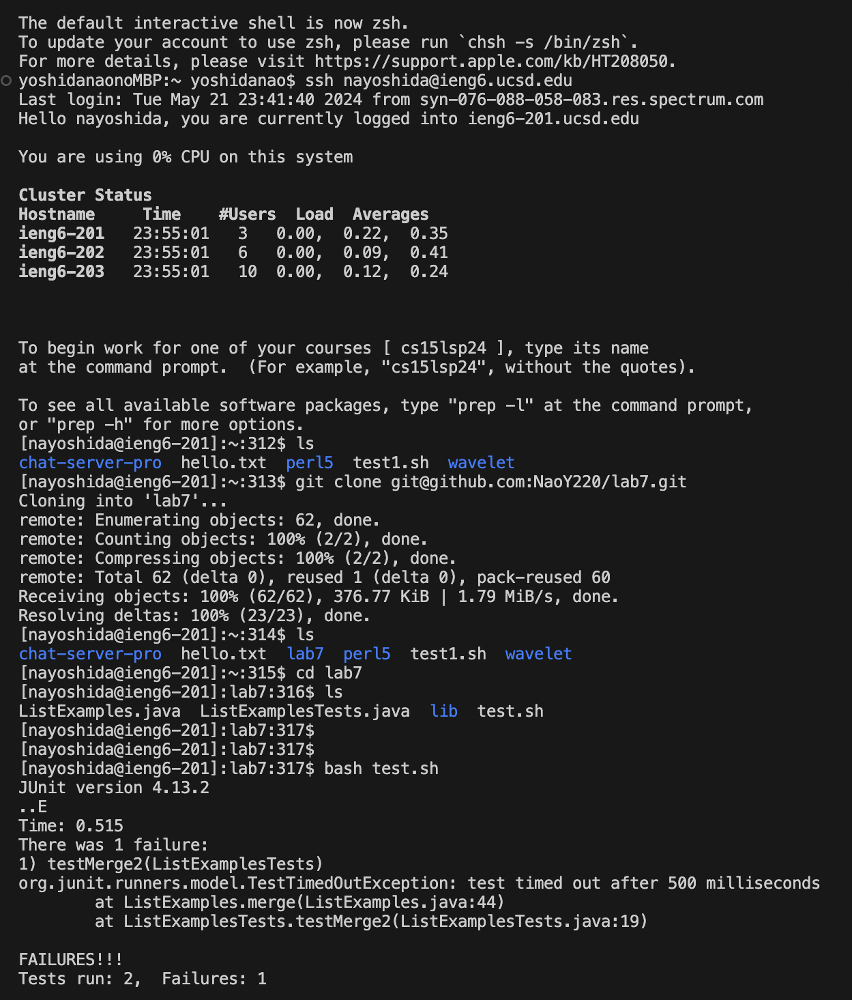

Lab Report 4
========= 
***

Name: Nao Yoshida |
PID:  A18083203 |
Spring 2024 UCSD - CSE 15L

***

Instruction
--------

1. Setup Delete any existing forks of the repository you have on your account. See this Github link on how to delete forks.
2. Setup Fork the repository
3. The real deal Start the timer!
4. Log into ieng6
5. Clone your fork of the repository from your Github account (using the SSH URL)
6. Run the tests, demonstrating that they fail
7. Edit the code file to fix the failing test
8. Run the tests, demonstrating that they now succeed
9. Commit and push the resulting change to your Github account (you can pick any commit message!) 

For each numbered step starting right after the timer (so steps **4-9**),

1. Take a screenshot
2. Write down exactly which keys you pressed to get to that step, including `<enter>` and `<space>` (e.g., `cd<space>L<tab><enter>` or `<down><down><down><down><down><down><down><enter>`). For special characters like `<enter>` or `<tab>`, write them in angle brackets with code formatting.
3. Then, summarize the commands you ran and what the effect of those keypresses were.

For example, when you run the tests, you might want to use the up arrow or Ctrl-R to access your bash history rather than typing in the full command with classpath, etc. You might say something like this accompanying the screenshot for running the tests:

    Keys pressed: `<up><up><up><up><enter>`, `<up><up><up><up><enter>` The `javac -cp .:lib/hamcrest-core-1.3.jar:lib/junit-4.13.2.jar *.java` command was 4 up in the search history, so I used up arrow to access it. Then the `java -cp .:lib/hamcrest-core-1.3.jar:lib/junit-4.13.2.jar org.junit.runner.JUnitCore ...` command was 4 up in the history, so I accessed and ran it in the same way.

***

**1. Take a screenshot**

--------
   
**2. Write down exactly which keys you pressed to get to that step, including <enter> and <space> (e.g., cd<space>L<tab><enter> or <down><down><down><down><down><down><down><enter>). For special characters like <enter> or <tab>, write them in angle brackets with code formatting.**

<ins>`history` command:</ins>

    [nayoshida@ieng6-201]:lab7:324$ history
    1  ls
    2  git clone git@github.com:NaoY220/lab7.git
    3  ls
    4  cd lab7
    5  ls
    6  bash test.sh
    7  vim ListExamplesTests.java
    8  vim ListExamples.java
    9  bash test.sh
    10  git add .
    11  git commit -m "Commited"
    12  git push origin main
    13  history

<ins>Keys pressed:</ins>

Keys pressed: `ssh nayoshida@ieng6.ucsd.edu<enter>` to log into my ieng6 account remotely(no need to enter passward because I set keyphrase ""). `ls<enter>` to see current contents of directory. `git clone git@github.com:NaoY220/lab7.git<enter>` to clone lab7 from my GitHub account. `ls<enter>` to see if lab7 content is in current directory. `cd lab7<enter>` to set current directory to be lab7. `<up><up><enter>` to set `ls` see current contents of directory. `bash test.sh<enter>` to run test if there is no failure.  `vim ListExamplesTests.java<enter>` to see contents of `ListExamplesTests.java`. `:q<enter>` to exit the `ListExamplesTests.java`. `vim ListExamples.java<enter>` to see contents of `ListExamples.java`. `44G<right><right><right><right><right><right>i<delete "1"><type "2"><escape>:wq<enter>` to modify the buggy code which cause test failure. `<up><up><up><enter>` to get `bash test.sh` to run test and it shows success run of tests. `git add .<enter>` to all change in the current diirectory. `git commit -m "Commited<enter>"` to save a snapshot of my change. `git push origin main<enter>` to appear all change in GitHub. `history` to get all change.

--------

**3. Then, summarize the commands you ran and what the effect of those keypresses were.**

1. `ssh nayoshida@ieng6.ucsd.edu`: remotely logging to account `nayoshida@ieng6.ucsd.edu`.

Result of command:

    yoshidanaonoMBP:~ yoshidanao$ ssh nayoshida@ieng6.ucsd.edu
    Last login: Tue May 21 23:41:40 2024 from syn-076-088-058-083.res.spectrum.com
    Hello nayoshida, you are currently logged into ieng6-201.ucsd.edu
    
    You are using 0% CPU on this system
    
    Cluster Status 
    Hostname     Time    #Users  Load  Averages  
    ieng6-201   23:55:01   3   0.00,  0.22,  0.35
    ieng6-202   23:55:01   6   0.00,  0.09,  0.41
    ieng6-203   23:55:01   10  0.00,  0.12,  0.24

    To begin work for one of your courses [ cs15lsp24 ], type its name 
    at the command prompt.  (For example, "cs15lsp24", without the quotes).
    
    To see all available software packages, type "prep -l" at the command prompt,
    or "prep -h" for more options.

2. `ls`: show the contents of current working directory if not specified directory in command.

Result of command:

    [nayoshida@ieng6-201]:~:314$ ls
    chat-server-pro  hello.txt  lab7  perl5  test1.sh  wavelet

3.  `git clone git@github.com:NaoY220/lab7.git`: clone repository under the link. `nayoshida@ieng6.ucsd.edu` is connecting to my GitHub account, so I use SSH link instead `https`. 

Result of command:

    [nayoshida@ieng6-201]:~:313$ git clone git@github.com:NaoY220/lab7.git
    Cloning into 'lab7'...
    remote: Enumerating objects: 62, done.
    remote: Counting objects: 100% (2/2), done.
    remote: Compressing objects: 100% (2/2), done.
    remote: Total 62 (delta 0), reused 1 (delta 0), pack-reused 60
    Receiving objects: 100% (62/62), 376.77 KiB | 1.79 MiB/s, done.
    Resolving deltas: 100% (23/23), done.

4.  `cd lab7`: change the current directory to be `lab7`

    [nayoshida@ieng6-201]:~:315$ cd lab7
    [nayoshida@ieng6-201]:lab7:316$
   
5.  `bash test.sh`: `bash` run `sh` file. `test.sh` will compile `java` files. 

`test.sh`:

    javac -cp .:lib/hamcrest-core-1.3.jar:lib/junit-4.13.2.jar *.java
    java -cp .:lib/hamcrest-core-1.3.jar:lib/junit-4.13.2.jar org.junit.runner.JUnitCore ListExamplesTests

Result of command:

    [nayoshida@ieng6-201]:lab7:317$ bash test.sh
    JUnit version 4.13.2
    ..E
    Time: 0.515
    There was 1 failure:
    1) testMerge2(ListExamplesTests)
    org.junit.runners.model.TestTimedOutException: test timed out after 500 milliseconds
            at ListExamples.merge(ListExamples.java:44)
            at ListExamplesTests.testMerge2(ListExamplesTests.java:19)
    
    FAILURES!!!
    Tests run: 2,  Failures: 1

Result of command:

    [nayoshida@ieng6-201]:lab7:320$ bash test.sh
    JUnit version 4.13.2
    ..
    Time: 0.013
    
    OK (2 tests)

6.  `vim ListExamplesTests.java`: allow user to see/edit `ListExamplesTests.java` using `vim` command.

7.  `vim ListExamples.java`: allow user to see/edit `ListExamples.java` using `vim` command.

8.  git add .

9.  11.  git commit -m "Commited"

10.  git push origin main

11.  history

--------

Completed: 21th May, 2024 

Lab due: 21th May, 2024 

GitHub link: 
