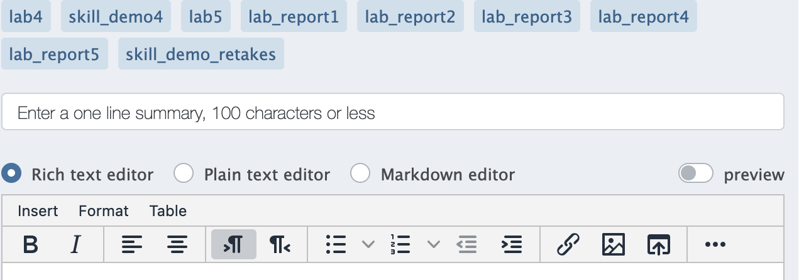
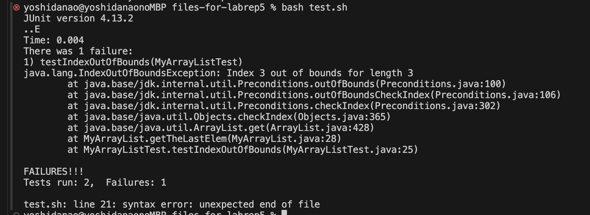
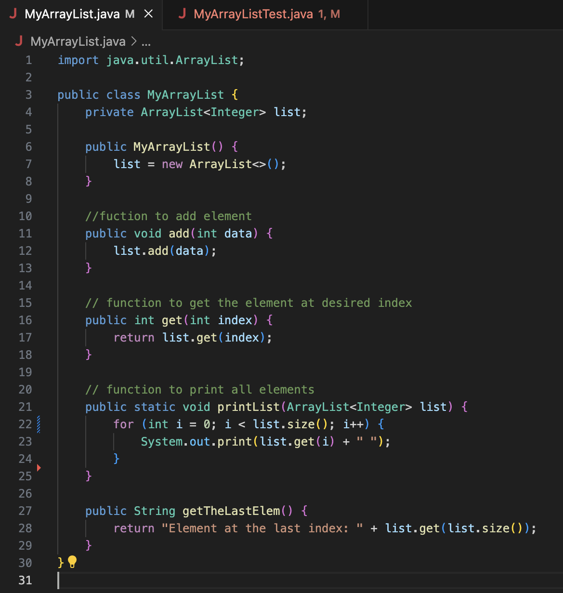
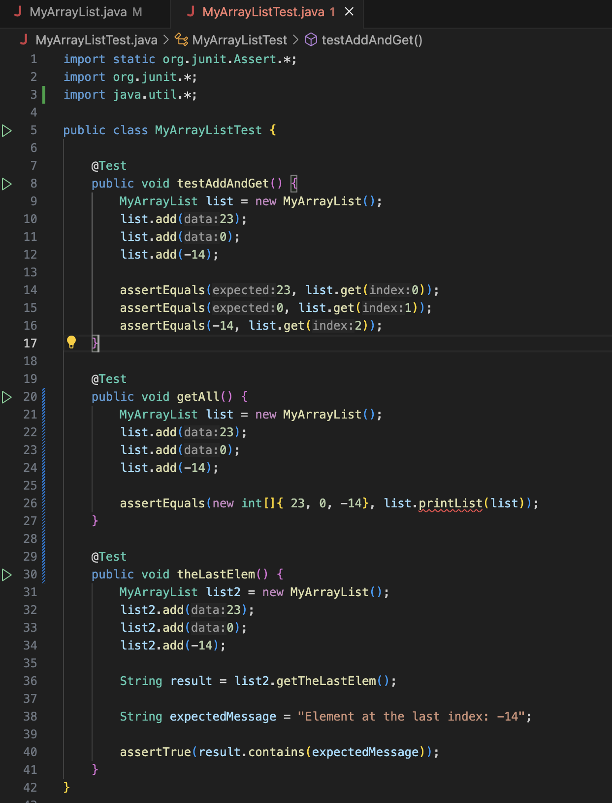
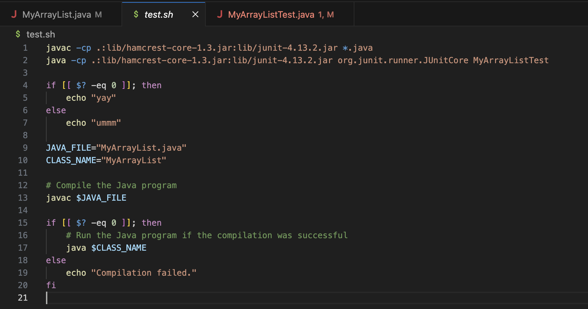
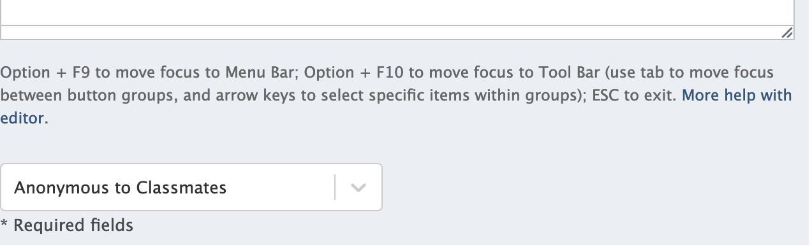
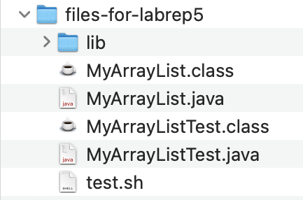

Lab Report 5
========= 
***

Name: Nao Yoshida |
PID:  A18083203 |
Spring 2024 UCSD - CSE 15L

***

**Part 1 – Debugging Scenario**
--------

Design a debugging scenario, and write your report as a conversation on Piazza (you don't need to make a post). It should have:

1. The original post from a student with a screenshot showing a symptom and a description of a guess at the bug/some sense of what the failure-inducing input is. (Don't actually make the post! Just write the content that would go in such a post)
2. A response from a TA asking a leading question or suggesting a command to try (To be clear, you are mimicking a TA here.)
3. Another screenshot/terminal output showing what information the student got from trying that, and a clear description of what the bug is.
4. At the end, all the information needed about the setup including:

- The file & directory structure needed
- The contents of each file before fixing the bug
- The full command line (or lines) you ran to trigger the bug
- A description of what to edit to fix the bug

You should actually set up and run the scenario from your screenshots. It should involve **at least a Java file and a bash script**. Describing the bug should involve reading some output at the terminal resulting from running one or more commands. Design an error that produces more interesting output than a single message about a syntax or unbound identifier error – showcase some interesting wrong behavior! Feel free to set this up by cloning and breaking some existing code like the grading script or code from class, or by designing something of your own from scratch, etc.

-----

**1. The original post from a student with a screenshot showing a symptom and a description of a guess at the bug/some sense of what the failure-inducing input is. (Don't actually make the post! Just write the content that would go in such a post)**

Hi, I am creating the java file using ArrayList and use functions to display the element of ArrayList. However, I am stacked working on creating JUnit tests. I am trying to call function `printList(ArrayList)` but it says there is an error and I do not figure out how I can remove the red underline on it.

`assertEquals(new int[]{ 23, 0, -14}, list.printList(list));`

.png)

I think I have something problem on code in main java rather than java file for testing. However, I do not figure out how I can solve it... I think `list.printList(list)` has problem, and I expect that call function and insert the object itself is problematic. Could you give me some advise? Also, the result run using bash script is following. I see there is problem on line 25, but I think the for loop is correctly implemented since the index of ArrayList is starting from 0.

My java files and sh file are following:

Thank you!

**2. A response from a TA asking a leading question or suggesting a command to try (To be clear, you are mimicking a TA here.)**

To solve the problem that you have on `printList(ArrayList)`, pay attention to your parameter: `printList(ArrayList<Integer> list)`. The parameter accept `ArrayList<Integer>` not the object of `ArrayList object`. To print the contents of `ArrayList object`, you may return String value storing each element of that object rather than setting your method as `void` type. 

For bash script, you can see the sentence `java.lang.IndexOutOfBoundsException: Index 3 out of bounds for length 3`, so there should be the problem on setting your range of index to get your value from your `ArrayList object`. You said that there is problem on line 25, but it is not in main java, but it is in `MyArrayListTest`. 

        at MyArrayList.getTheLastElem(MyArrayList.java:28)
        at MyArrayListTest.testIndexOutOfBounds(MyArrayListTest.java:25)

For `MyArrayList.java`, you have issue on line 28, and you can find the error code. For 25, it should be related to the problem on `printList(ArrayList)`.

In addition, you can see the error message `test.sh: line 21: syntax error: unexpected end of file` at the end of the output in terminal by `bash test.sh`. Since you do not receive any output "yay" or "ummm", then you should have the error around there. Also, I see you have the code `javac $JAVA_FILE` and `java $CLASS_NAME`. Check if it works in your terminal. Is there any `main` method in your code?

**3. Another screenshot/terminal output showing what information the student got from trying that, and a clear description of what the bug is.**

Thank you so much for your advise. Yes, I had a lot of error in my code. 
First, I forget to put `-1` next to `list.size()`. The last index number is equal to the `list.size()-1`

        public String getTheLastElem() {
                return "Element at the last index: " + list.get(list.size()-1);
        }

Second, I changed the contents of method `printList()` as the advise, I cahnged my return type to be String and I created String variable `result` and store each element of ArrayList using for loop with `\n`:

        // function to print all elements
        public String printList() {
                String result = "";
                for (int i = 0; i < list.size(); i++) {
                    result = result + list.get(i) + "\n";
                }
                return result;
        }
        
Also, I modified my Test code as the change in printList():
        
Finally, I realized that I forgot to put `fi` at the end of if/else statement, so I added it to the end of that statement, and since I do not have the main method inside the `MyArrayList` and I use JUnit test, so I deleted everything:

        if [[ $? -eq 0 ]]; then
            echo "yay"
        else
            echo "ummm"
        fi  #I forgot here

Finally, I get by `bash test.sh`:

        yoshidanao@yoshidanaonoMBP files-for-labrep5 % bash test.sh
        JUnit version 4.13.2
        ...
        Time: 0.008
        
        OK (3 tests)
        
        yay

**4. At the end, all the information needed about the setup including:**

- The file & directory structure needed

- The contents of each file before fixing the bug

  
- The full command line (or lines) you ran to trigger the bug

Note: I use JUnit test run.

- A description of what to edit to fix the bug

1) Put `-1` next to `list.size()` since the last index number is equal to the `list.size()-1`:

        public String getTheLastElem() {
                return "Element at the last index: " + list.get(list.size()-1);
        }

before fixed: 

        public String getTheLastElem() {
                return "Element at the last index: " + list.get(list.size());
        }

2) Changed the contents of method printList() with new return type from void to String. Then, added String variable `result` to store each element of `ArrayList` using for loop with `\n`:

        // function to print all elements
        public String printList() {
                String result = "";
                for (int i = 0; i < list.size(); i++) {
                        result = result + list.get(i) + "\n";
                }
                return result;
        }

before fixed: 

        // function to print all elements
        public static void printList (ArrayList<Integer> list) {
                for (int i = 0; i < list.size(); it+) {
                System.out.print (list.get(i)+ " ");
        }

3) Modified the Test code for `printList()`:

        @Test
        public void printAll() {
                MyArrayList list = new MyArrayList();
                list.add(23);
                list.add(0);
                list.add(-14);

                assertEquals("23\n0\n-14\n", list.printList());
        }
   
before fixed: 

        @Test
        public void getAll(){
                MyArrayList list = new MyArrayList();
                list.add(23);
                list.add(0);
                list.add(-14);
                assertEquals (new int[]{ 23, 0, -14}, list.printList(list));
        }

4) Put `fi` at the end of `if/else` statement. Since I do not have the main method inside the `MyArrayList` and I use JUnit test, so I deleted everything after the first `if/else` statement:

        if [[ $? -eq 0 ]]; then
            echo "yay"
        else
            echo "ummm"
        fi  #I forgot here

before fixed: 

        if [[ $? -eq 0 ]]; then
            echo "yay"
        else
            echo "ummm"
            
        JAVA_FILE="MVArravList.iava"
        CLASS_NAME="MyArrayList"
        
        # Compile the Java program
        javac $JAVA_FILE
        
        if [[ $? -eg 0 ]]; then
            # Run the Java program if the compilation was successful
            java $CLASS_NAME
        else
            echo "Compilation failed."
        fi

***

**Part 2 – Reflection**
--------

In a couple of sentences, describe something you learned from your lab experience in the second half of this quarter that you didn't know before. It could be a technical topic we addressed specifically, something cool you found out on your own building on labs, something you learned from a tutor or classmate, and so on. It doesn't have to be specifically related to a lab writeup, we just want to hear about cool things you learned!

----

During the second half of this quarter, there were a lot new commands such that `VIM` and some additional command which we can use in bash like `grep`, `find` and `wc`... It was interesting to know that we can edit files or do a lot tasks with only using Terminal since I had learned languages using IDEs rather than using Terminal command till I came here. I am really enjoying learning new things and it should help me a lot in the future with programming!

***

Completed: June 6th, 2024 

Lab due: June 6th, 2024 

GitHub link: https://naoy220.github.io/cse15l-lab-reports/labReport5.html
